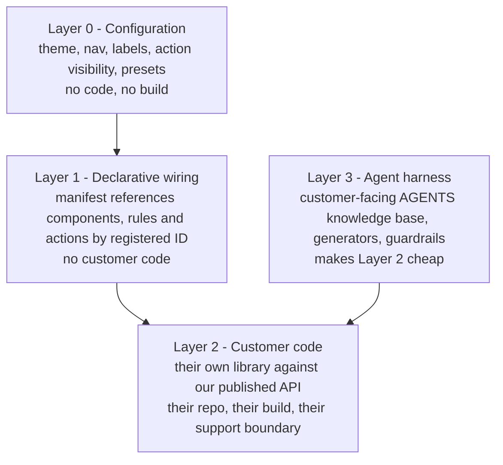
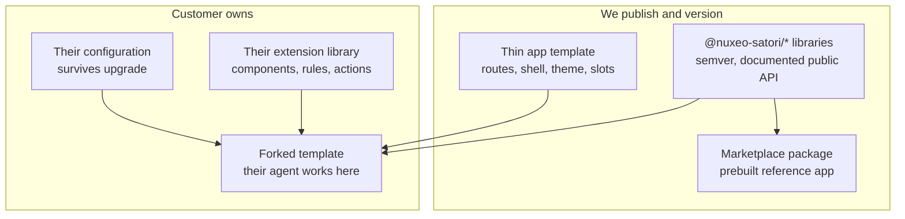

# adf-hx Beta Deliverable — Plan

## Decisions locked

- **adf-hx consumption:** install `@alfresco/adf-hx-content-services` as a real dependency once a `read:packages` token exists. No vendoring.
- **Beta scope:** a deep core slice — browse, folder tree, search, document detail, metadata, permissions, versions, upload/CRUD. Workflow, users and groups, administration and publishing are out.
- **Customization model:** a four-layer extensibility contract. AI agents are the authoring accelerator for that contract, **not** a licence to edit our source. The contract is the product.
- **Distribution:** versioned libraries plus a thin forkable app template.

## The extensibility contract



Layers 0 and 1 absorb most real customer requests and need no build. Layer 2 is where new behaviour lives, because a manifest can only rewire what is already compiled in — ACA's own `extensions.setComponents({...})` registration confirms this. Layer 3 is the differentiator: the agent works inside the customer's extension library and the thin template, never in our library source, which is what preserves the support boundary and the certification claims in NXENG-615.

## Distribution and upgrade model



Upgrades are an npm version bump for the platform, plus occasional small merges in the template. That is only true if the public API is genuinely stable — see the adf-hx encapsulation risk below.

### Where configuration lives

The marketplace installer is destructive today:

```xml
<copy dir="${package.root}/web" todir="${env.server.home}/nxserver" overwrite="true" />
```

So configuration must not live inside the packaged `web` directory. Split it:

- **Bootstrap config** (pre-auth: Nuxeo server URL, base href, branding shell, manifest location) on a static path the installer does not overwrite, requiring a second non-overwriting copy step in [nuxeo-agentic-ui-package/src/main/resources/install.xml](nuxeo-agentic-ui-package/src/main/resources/install.xml).
- **Runtime manifest** (nav, actions, rules, presets, toggles) as a **Nuxeo document** at `/default-domain/config/agentic-ui`, fetched through the existing authenticated `HttpClient`, with the packaged default as fallback. This inherits Nuxeo versioning, audit, ACLs and per-tenant scoping for free, and can be edited from the app itself.

## Research findings that constrain the design

- `@alfresco/adf-hx-content-services` is v0.0.8, GitHub Packages only (404 on public npm). Components: `document-list`, `document-tree`, `breadcrumb`, `metadata-sidebar`, `permission`, `manage-versions`, `search`, `document-viewer`, `document-type-icon`, `actions`, `properties-viewer-content`, `skeleton-loader`.
- `@alfresco/adf-core` and `@alfresco/adf-extensions` **are** on public npm (9.0.0 stable plus the 9.2.0 snapshot HFA uses), peers Angular >= 20.3.25. **No token needed, so Layers 0-1 are unblocked today.**
- HFA `develop` runs Angular 20.3.27, Material 20.2.14, TS 5.8.3, Satori 0.2.0, hxcs-js-client 2.0.111 — this branch already matches. The ticket's "Angular 21" note is stale.
- Adopting any adf-hx component pulls in the ADF DataTable stack: `document-list.component.ts` imports `DataTableComponent`, `DataColumnListComponent`, `ContextMenuOverlayService` and `provideTranslations` from `@alfresco/adf-core`.
- The repo has **no runtime configuration layer at all**, no action registry, nothing publishable, and every label is literal English despite `TranslateModule` being registered.

## Phase 0 — Unblock and verify (2-4 d)

1. Request a GitHub PAT with `read:packages` for the Alfresco org, plus `SATORI_GH_READONLY_TOKEN`. Both must reach GitHub Actions secrets or CI cannot install. Phases 1-2 proceed without them.
2. Resolve the scope conflict in [.npmrc](.npmrc): all of `@alfresco` currently routes to `npm.pkg.github.com`, but adf-core and adf-extensions come from public npm while adf-hx comes from GitHub Packages. npm resolves per scope, not per package.
3. `npm ci`, then `npx nx affected -t lint build test`. Nothing on this branch has ever been validated — `node_modules` predates its own Angular 20 upgrade.
4. Delete the unused Material `hxp-document-tree` and open a draft PR so CI runs.

## Phase 1 — Layer 0: upgrade-safe configuration (12-18 d, unblocked)

- Add the non-overwriting config path to `install.xml`, and a bootstrap config fetched by an `APP_INITIALIZER` in [apps/nuxeo-ui/src/app/app.config.ts](apps/nuxeo-ui/src/app/app.config.ts). Repoint the existing 12+ `InjectionToken` factories (`nuxeo-api.config.ts`, `ai.config.ts`, `kd.config.ts`, `adf-hx-bridge.tokens.ts`) at it — the token pattern is already the intended override idiom, so this converts the set in one move.
- Load the runtime manifest from the Nuxeo config document, with packaged fallback and tolerant failure.
- **Theming:** replace the four hardcoded `html[data-app-theme=...]` blocks in [apps/nuxeo-ui/src/styles.scss](apps/nuxeo-ui/src/styles.scss) with config-driven CSS custom properties, and delete the `!important` override block at lines 142-291 that would otherwise fight customer CSS.
- **i18n:** activate the inert `TranslateModule` and extract strings **for the slice only**. Full-repo extraction is an 8-12 d task and is not Beta-critical.

## Phase 2 — Layer 1: extension registry (15-22 d, unblocked)

Add `libs/shared/extensions` wrapping `@alfresco/adf-extensions`.

- **Rules:** register the pure predicates in [libs/shared/nuxeo-client/src/lib/utils/document-permissions.ts](libs/shared/nuxeo-client/src/lib/utils/document-permissions.ts) (`canWriteDocument`, `canRemoveDocument`, `canAddChildren`, `canManageDocumentPermissions`) as named evaluators. They are already the right shape, just called inline from templates.
- **Navbar, sidebar and routes:** convert `PLATFORM_NAV_ITEMS` in [apps/nuxeo-ui/src/app/platform-nav-items.ts](apps/nuxeo-ui/src/app/platform-nav-items.ts) from a compiled `const` to a manifest-fed token, and remove the ~15 hardcoded path getters at lines 389-459 of [apps/nuxeo-ui/src/app/shell/nav-drawer/nav-drawer.component.ts](apps/nuxeo-ui/src/app/shell/nav-drawer/nav-drawer.component.ts) that currently make a manifest-added nav item render an empty drawer. Feature libs already export `Routes` arrays, so route injection is one indirection.
- **Actions:** the largest refactor. Convert the hardcoded toolbar, the seven-item overflow menu and the five hardcoded `mat-tab` children in `document-detail.html` (2,000+ lines), plus the six fixed `@Output()` buttons in `selection-topbar.component.html`, into declarative action descriptors resolved through the registry.
- Generalize and export the working `DynamicDrawerComponent` (`Type<unknown>` to `createComponent()`) as the shared component-resolution primitive that route, tab, viewer and drawer extensions all need.
- Implement `$references` merge so customer JSON layers over ours.

## Phase 3 — adf-hx adoption (20-30 d, BLOCKED on token)

Swap components in one at a time behind `/#/browse-adf-hx`, deleting each hand-written `hxp-*` equivalent as its real counterpart lands. Order by payoff: `document-list`, `breadcrumb`, `document-tree`, `metadata-sidebar`, `permission`, `manage-versions` (a capability the POC lacks entirely), `document-viewer`, `search`. Treat `document-list` as the spike that prices the rest — each component needs Nuxeo-backed implementations of the tokens its adf-hx service expects, and that is the real integration risk.

**Encapsulation is a hard rule here.** adf-hx types must not appear in our public API signatures, enforced by a lint or API-extractor gate. At v0.0.8 with two unreconciled roadmaps, its instability must not become our customers' instability.

Fix the bridge defects in the same phase, since adf-hx components consume the mapped documents: hardcoded `sys_effectivePermissions`, the silently dropped sort, the overwritten `totalCount`, the 50-child ceiling with no pager, and the `browse_column_settings` localStorage collision with production browse.

## Phase 4 — Layer 2: publishable platform (18-26 d)

- Give the libraries real build targets with ng-packagr. Today every `project.json` has only `lint` and `test`, and the only artifact is a prebuilt SPA zip — there is nothing for a customer to depend on.
- **Declare the public API surface and a semver policy**, with an automated gate so internal types cannot leak into it. This is what makes upgrades a version bump rather than a merge.
- Expose the registration API — our equivalent of `setComponents`, `setEvaluators` and `setAuthGuards` — so customer code can contribute by ID.
- Build the thin forkable app template and a customer extension-library starter.

## Phase 5 — Layer 3: agent harness (8-12 d)

- Split the `AGENTS/` knowledge base into internal and customer-facing halves. Today it documents our internals; shipped, it becomes a versioned product artifact.
- Add Nx generators for "new extension component", "new action", "new rule" so an agent produces conforming code by default.
- Adapt `scripts/review-guardrails.mjs` into guardrails a customer's agent can run to verify its own changes.

## Phase 6 — Beta quality bar and proof (20-30 d)

- NXENG-615's checklist, assessed against the slice: unit coverage above 90% (the bridge has 11 tests for 2,949 lines today), Playwright E2E on critical paths, WCAG 2.1 AA, SAST and SCA clean, Chrome and Safari verified.
- **Reference customer extension** exercising Layers 0-2 — a nav item, a rule-gated action, a custom component and a rebrand — with zero edits to our libraries.
- **Upgrade rehearsal:** install, customize, upgrade to the next version, and verify configuration and extensions both survive. This is the test that actually proves the model.

## Timeline

| Phase                 | Focused      | With AI support |
| --------------------- | ------------ | --------------- |
| 0 — Unblock           | 2-4 d        | 1-2 d           |
| 1 — Layer 0 config    | 12-18 d      | 7-11 d          |
| 2 — Layer 1 registry  | 15-22 d      | 9-14 d          |
| 3 — adf-hx adoption   | 20-30 d      | 13-19 d         |
| 4 — Layer 2 platform  | 18-26 d      | 11-16 d         |
| 5 — Layer 3 harness   | 8-12 d       | 4-7 d           |
| 6 — Quality and proof | 20-30 d      | 12-18 d         |
| **Total**             | **95-142 d** | **57-87 d**     |

That is roughly 5-7 months focused, or 3-4 months with AI support. Against the epic's Q3/Q4 2026 Beta target, only the AI-supported pace fits. **If it slips, gate Beta on Phases 0-3 plus 6 (Layers 0-1 and the slice) and follow with Layers 2-3** — that ships a configurable, upgrade-safe, adf-hx-based product and defers customer-authored code to GA.

## Risks

- **Token provisioning is an external dependency** with no committed date. Phase 3 and CI installs both wait on it.
- **adf-hx is v0.0.8 with two unreconciled roadmaps.** Mitigated only by the encapsulation gate in Phase 3; if adf-hx types reach our public API, every upstream change becomes a customer-visible break.
- **The ADF DataTable stack arrives with adf-hx** — adf-core, Material, ngx-translate and js-api. A large new dependency surface for a package shipped to on-premises customers, with SCA implications.
- **This branch carries the monorepo Angular 20 upgrade** while `main` is on 19 with Dependabot still opening 19.2.x bumps. Strongly consider landing the upgrade as its own PR first.
- **Manifest-as-Nuxeo-document needs the packaging owner's sign-off**, along with the non-overwriting `install.xml` change. If either is refused, fall back to a static path outside `nxserver/web`.
- **Selection state is shared with production browse**, so the Satori bulk topbar overlays the POC route today. Decide whether the Beta app keeps one shell or forks it.

## Still open

- Who provisions the `read:packages` token, and by when?
- Does Beta ship as a marketplace package, an npm library set, or both? Phase 4 assumes both, since the reference app and the customer build path have different artifacts.
- Do we keep `/#/browse-adf-hx` as a parallel route through Beta, or cut over `/#/browse` once parity is reached?
- How much of the app becomes addressable by ID in Layer 1? That decision sets the ceiling on what any manifest can express, and it is worth fixing explicitly before Phase 2 starts.
