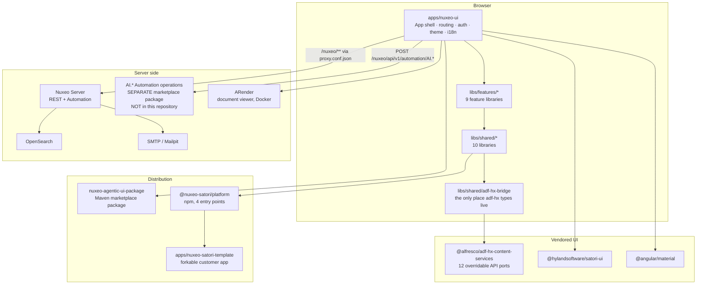
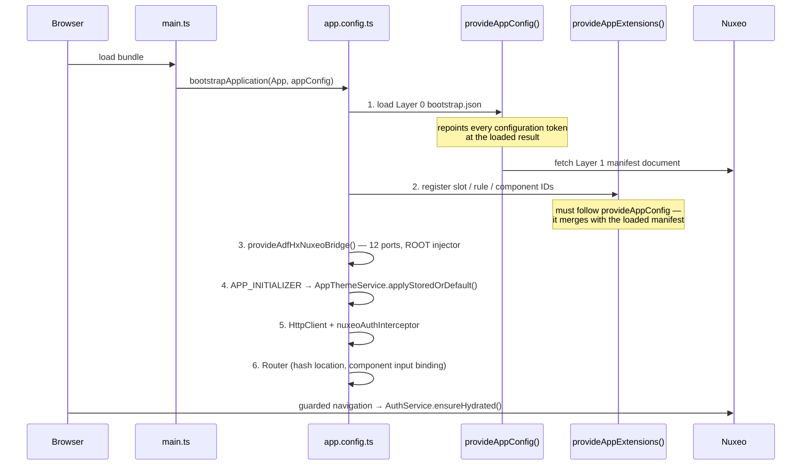
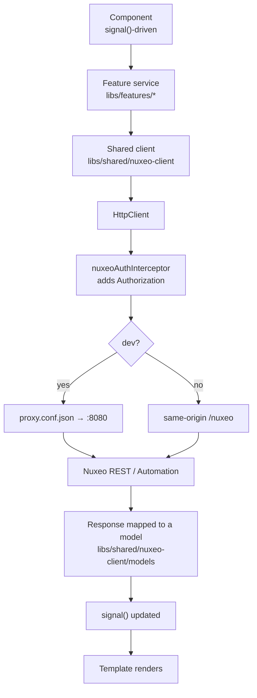
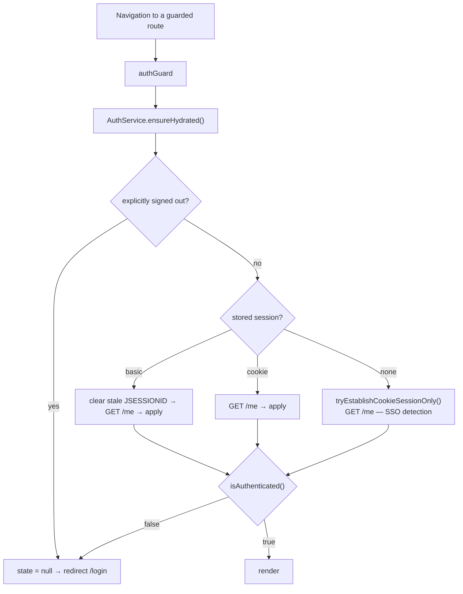
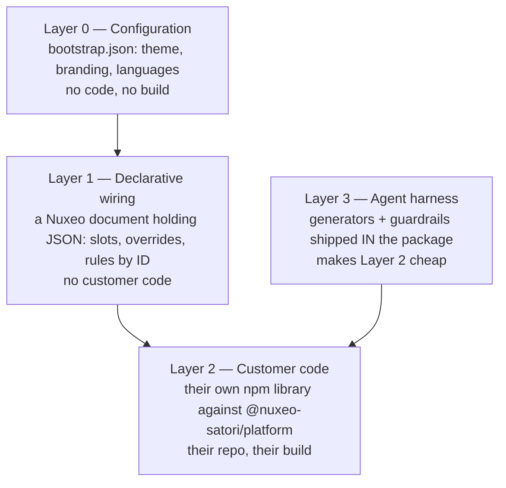
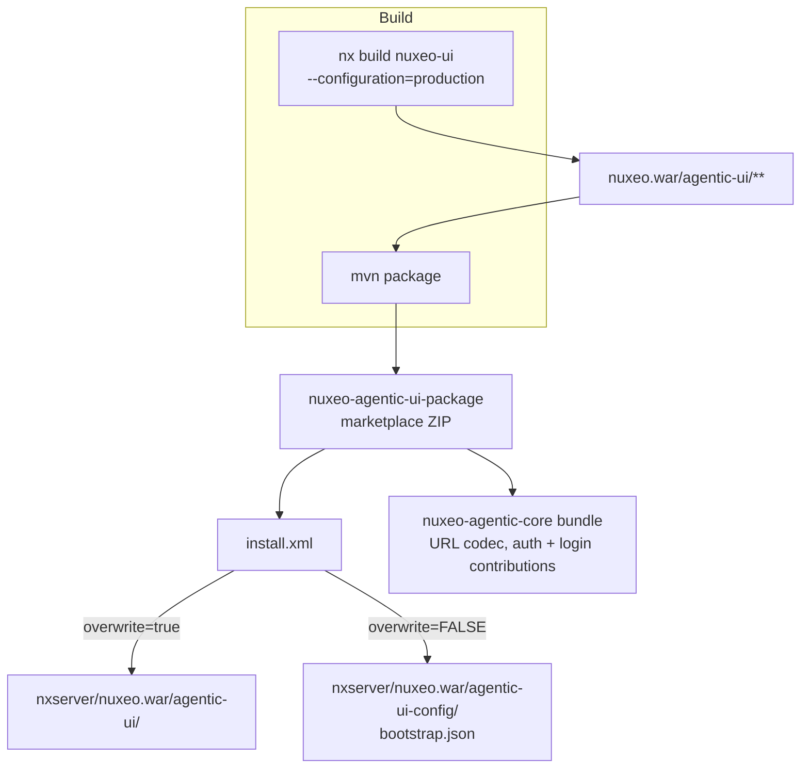
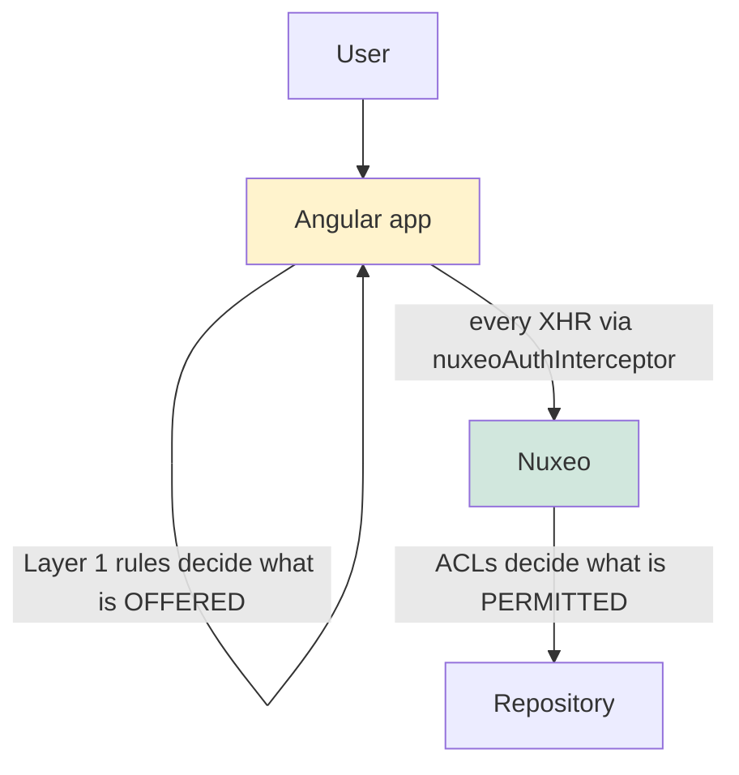

# Architecture

> **Last reviewed:** 2026-08-24 · **Repository:** `77265f9`
> Supersedes [`docs/architecture.md`](../../docs/architecture.md) (54 lines) and the
> architecture sections of [`docs/technical-walkthrough.md`](../../docs/technical-walkthrough.md).

---

## 1. System architecture



**The load-bearing fact:** the AI operations are invoked by this application but
**implemented elsewhere**. An absent backend produces HTTP 500, which is expected and not a
client defect ([`CLAUDE.md`](../../CLAUDE.md), Environment).

---

## 2. Layered model, and the rule that keeps it honest

```text
apps/nuxeo-ui             App shell — routing, auth, global search, theme, i18n
    ↓ lazy-loads
libs/features/*           9 feature libraries. NEVER import each other
    ↓ imports from
libs/shared/*             Services, UI components, models, clients
    ↓ calls
Nuxeo Server              via proxy in dev, same-origin in prod
```

Enforced since 2026-08-24 by real `depConstraints` in
[`eslint.config.mjs`](../../eslint.config.mjs). Before that the rule was `error` with Nx's
scaffolded `sourceTag: '*' → onlyDependOnLibsWithTags: ['*']`, which permits every edge in
the graph — so the rule had never rejected anything and four violations had accumulated,
including a `libs/shared/` library that depended on two feature libraries.

| Source tag         | May depend on                                           |
| ------------------ | ------------------------------------------------------- |
| `type:app`         | features, ui, data-access, util, extension, publishable |
| `scope:features`   | `scope:shared`, `scope:core`                            |
| `scope:shared`     | `scope:shared`, `scope:core`                            |
| `scope:core`       | `scope:core` only                                       |
| `type:extension`   | `type:publishable`, `scope:shared` — see the note below |
| `type:publishable` | `scope:shared`, `scope:core`                            |

The `type:extension` row is deliberately weaker than it looks, and the config says so:
`tsconfig.base.json` maps `@nuxeo-satori/platform/extensions` to
`libs/shared/extensions/src/index.ts`, so the supported specifier and a raw internal import
are the **same graph edge to the same project**. A tag constraint sees projects, not
specifiers. What actually enforces the entry-point boundary is
[`libs/platform/guardrails/check-extension-library.mjs`](../../libs/platform/guardrails/check-extension-library.mjs)
check 2, which works on the specifier text.

---

## 3. Runtime architecture — startup order matters

The composition root is [`apps/nuxeo-ui/src/app/app.config.ts`](../../apps/nuxeo-ui/src/app/app.config.ts),
and its ordering is not cosmetic:



Three consequences worth knowing before you touch startup:

1. **The adf-hx ports must be in the root injector.** Eleven upstream services are
   `providedIn: 'root'` and resolve the port tokens from the root injector —
   `SingleItemCopyService`, `SingleItemMoveService`, `CreateDocumentVersionService`,
   `RestoreDocumentVersionService`, `BlobDownloadService`, `SharedDocumentService`,
   `RenditionsService`, `DocumentModelService`, `SearchService`, `UserService`,
   `RouterExtService`. Providing them on a component instead fails one `NG0201` at a time.
   The cost is that adf-core becomes eager: initial bundle 1.71 MB → 2.86 MB, accepted
   deliberately with the reasoning recorded at
   [`app.config.ts:37`](../../apps/nuxeo-ui/src/app/app.config.ts#L37).
2. **`provideAppInitializer` callbacks run concurrently.** A one-shot config read races the
   loader. Do not assume ordering between initializers.
3. **`withHashLocation()` changes what a "reload" means.** `goto('/#/x')` is
   same-document, so `APP_INITIALIZER` never re-runs. Any test asserting a _reloaded_ app
   needs a real `page.reload()`.

---

## 4. Request lifecycle



**Every request passes the interceptor** — which is why `` is
forbidden. The browser fetches an `img` itself, bypassing the interceptor entirely, so it
carries no `Authorization` header and works only on an ambient session cookie, while
putting an internal API URL in the DOM. The correct pattern is: fetch the blob through a
service, hand the template a blob URL, revoke it on destroy. Both halves are gated
(`checkNoNuxeoUrlInImgSrc`, `checkBlobUrlLifecycle` in
[`scripts/review-guardrails.mjs`](../../scripts/review-guardrails.mjs)).

---

## 5. Authentication and authorisation

[`apps/nuxeo-ui/src/app/auth/`](../../apps/nuxeo-ui/src/app/auth) — `AuthService`,
`authGuard`, `loginGuard`, `adminGuard`, the interceptor, session-timeout handling and
share-token support.



### A fact that makes a whole class of test untestable locally

The local Nuxeo has **anonymous authentication enabled**. `GET /nuxeo/api/v1/me` with _no
credentials at all_ returns HTTP 200 and `{ id: 'Anonymous' }`, through the proxy and
directly. So `tryEstablishCookieSessionOnly()` — the intentional SSO-detection path —
adopts an Anonymous session and `isAuthenticated()` is true.

`authGuard` is sound. But "an unauthenticated visitor is redirected to /login" cannot be
observed in this environment, and removing Playwright's `httpCredentials` does not help
because credentials were never what made `/me` succeed. Test the **privilege** boundary
instead: `apps/nuxeo-ui-e2e/src/auth.spec.ts` asserts a signed-out visitor _is_ redirected
and that Anonymous is _not_ granted administration access.

**Product implication:** a customer deploying with anonymous auth enabled gets an app that
signs unauthenticated visitors in as `Anonymous`. That is the server's decision, faithfully
reflected — but it is invisible from the UI.

---

## 6. The customisation architecture — four layers

Detailed in [Extensibility Contract](07-extensibility-contract.md). In outline:



**52 registered IDs** today, drift-gated by `npm run beta:reference`: 17 navbar, 15 rules,
3 sidebar, 1 routes, plus actions and components. Of the 8 slots, `navbar` and
`bulk-actions` have packaged descriptors and a host that renders them, `documentList` is
registered with twelve columns and resolved by both browse routes, `sidebar` is resolved
with no packaged descriptor, and `routes`, `toolbar`, `contextMenu` and `tabs` are
**reserved with nothing reading them**. Do not describe a reserved ID as an extension
point.

---

## 7. Deployment architecture



The `overwrite="false"` on the config copy is the mechanism that makes Layer 0 survive an
upgrade, and the reasoning is recorded in
[`install.xml`](../../nuxeo-agentic-ui-package/src/main/resources/install.xml): the
destination must be inside the directory Tomcat actually serves. The `nuxeo` context
declares `docBase="../nxserver/nuxeo.war"`, so `/nuxeo/agentic-ui-config/bootstrap.json`
resolves under `nxserver/nuxeo.war/`. `nxserver/web` holds only `root.war` and is not a
docBase — anything placed there is never served. An earlier version shipped
`nxserver/web/…` and **would have 404'd on every install**.

`nuxeo-agentic-core` is a small Java/OSGi bundle (189 lines) contributing an
`AgenticNotificationDocumentIdCodec`, an auth config fragment and a login start-page
fragment.

---

## 8. State management

| Concern                   | Mechanism                                          | Where                                                                                                                                    |
| ------------------------- | -------------------------------------------------- | ---------------------------------------------------------------------------------------------------------------------------------------- |
| Component UI state        | `signal()` / `computed()`                          | throughout `libs/features`                                                                                                               |
| Cross-component selection | `SelectionService` — tracks **ids**, not documents | [`libs/shared/nuxeo-client/src/lib/services/selection.service.ts`](../../libs/shared/nuxeo-client/src/lib/services/selection.service.ts) |
| Session                   | `AuthService` + `sessionStorage`                   | [`apps/nuxeo-ui/src/app/auth/auth.service.ts`](../../apps/nuxeo-ui/src/app/auth/auth.service.ts)                                         |
| Layer 0 config            | `AppConfigService`, loaded once at startup         | [`libs/shared/app-config`](../../libs/shared/app-config)                                                                                 |
| Layer 1 registries        | 4 registries keyed by opaque string                | [`libs/shared/extensions`](../../libs/shared/extensions)                                                                                 |
| Rule context              | `ExtensionRuleContextService`                      | same                                                                                                                                     |
| Phase state               | `.ai/state/phases.json`, gated                     | [`scripts/beta-harness/state-check.mjs`](../../scripts/beta-harness/state-check.mjs)                                                     |

No global store — no NgRx, no Redux. State is either component-local signals or a
`providedIn: 'root'` service exposing signals.

**The rule context has three independently populated halves**, and the distinction is
deliberate: `document` is written by document-detail alone and cleared on destroy, so the
seven document rules answer `false` on every other surface. `selectionCount` is populated
and live. `selection` — the documents themselves — is **still empty**, because
`SelectionService` tracks ids, so `canWriteSelection` and `canRemoveSelection` still answer
`false`. Do not collapse `selectionCount` into `selection.length`; that is what keeps the
distinction honest.

---

## 9. Error handling, retry and validation

| Layer          | Behaviour                                                                                                           |
| -------------- | ------------------------------------------------------------------------------------------------------------------- |
| HTTP           | `catchError` at the call site; services return typed models or `null`. No global error interceptor                  |
| Rules          | An **unregistered rule ID evaluates to `true`** (fail-open), except `SECURITY_RELEVANT_RULE_IDS`, which fail closed |
| Rule recursion | Bounded by **depth** (`MAX_RULE_DEPTH = 32`), not by visited rule type                                              |
| AI operations  | HTTP 500 when the backend package is absent — expected                                                              |
| E2E            | 1 retry locally, 2 in CI; trace/video/screenshot retained on failure only                                           |
| Gates          | Stop at first failure, cheapest-first                                                                               |

### Why fail-open, and why that is not a security hole

A manifest that names a rule this build does not have — a typo, or configuration written
against a newer release — must not silently strip working actions out of the UI. Failing
open is safe because **Layer 1 visibility is not an authorisation boundary**: the
server-side Nuxeo permission still decides whether the operation succeeds. Hiding an action
in a manifest is not a security control.

The exception is the small set of rules whose whole job is to keep a surface away from
users who should not see it — `app.rules.isAdministrator`, `isPowerUser`,
`hasAdministrationAccess`. Those are a **declared list rather than a property of
registration**, and that is the point: the dangerous window is exactly the one in which the
ID is not yet registered, so a marker attached at registration time could not close it.
`app.rules.hasAdministrationAccess` is contributed by the shell's `APP_INITIALIZER`, so any
consumer resolving the navbar earlier saw an unknown ID and got `true` — which would have
offered Administration to every user.

Recursion is bounded by depth because a _cycle_ is not expressible in JSON. The previous
implementation tracked visited rule _types_ and returned `true` on a repeat, which misread
ordinary nesting as a cycle: `core.some('hasAdministrationAccess', core.some('isPowerUser'))`
returned `true` for a user who was neither, while the flat equivalent correctly returned
`false`. A security gate opening because a rule appeared twice.

---

## 10. Security boundaries



- **The UI decides what is offered. Nuxeo decides what is permitted.** These are different
  boundaries and only the second is a security control.
- Credentials from environment only; never hardcoded, never in a URL query string.
- Query literals are escaped before interpolation —
  [`libs/shared/adf-hx-bridge/src/lib/api/hxql-literal.ts`](../../libs/shared/adf-hx-bridge/src/lib/api/hxql-literal.ts).
  The backslash is escaped **first**; the other order turns `\'` into `\\'`, a literal
  backslash followed by an unescaped quote, reopening the hole.
- Blob URLs are tracked at creation and revoked on destroy and on reset. A `SafeUrl` from
  `bypassSecurityTrustUrl` cannot be read back, so creation is the only point where the raw
  string exists.
- HTML is sanitised with DOMPurify where notes and comments are rendered.

Full detail in [`AGENTS/07-security.md`](../../AGENTS/07-security.md).

---

## 11. Observability

**Honest assessment: thin.** There is no APM, no structured logging pipeline, no metrics
export, and no error-reporting service wired in — **not verified in repository** because it
does not exist.

What does exist:

| Signal                 | Mechanism                                                                                                              |
| ---------------------- | ---------------------------------------------------------------------------------------------------------------------- |
| Browser console errors | Asserted against during evidence capture (`expectNoConsoleErrors`, with an explicit allowlist of environmental errors) |
| Build size             | CI ceiling of 6 MiB total shipped JS+CSS, with the reasoning recorded at the value                                     |
| Bundle contents        | `npm run beta:bundle` — banned symbols and required assets                                                             |
| Coverage trend         | `.ai/state/coverage-baseline.json` ratchet                                                                             |
| Accessibility          | axe scans in `phase-6-a11y`, ratcheted                                                                                 |
| Phase truth            | `npm run beta:state`                                                                                                   |

This is development-time observability, not production observability. See
[Scalability & Operations](../10-leadership/06-scalability-and-operations.md) for what a
production deployment would need to add.
