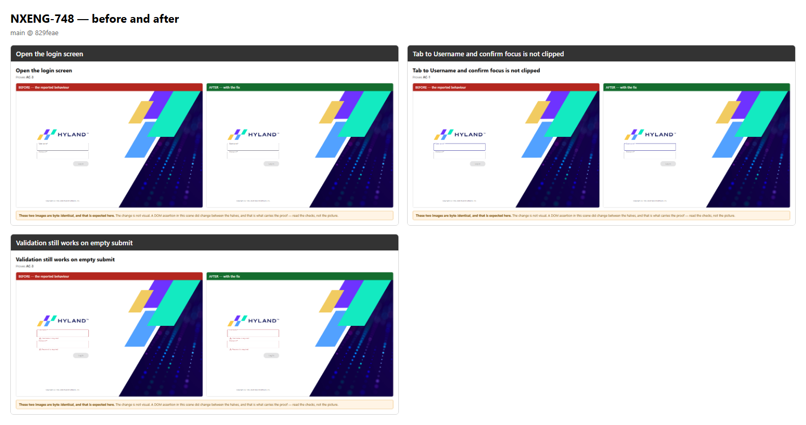
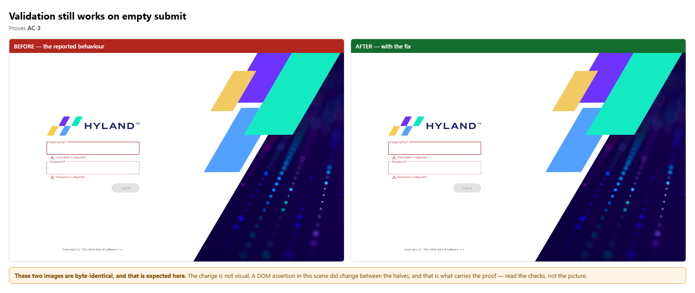
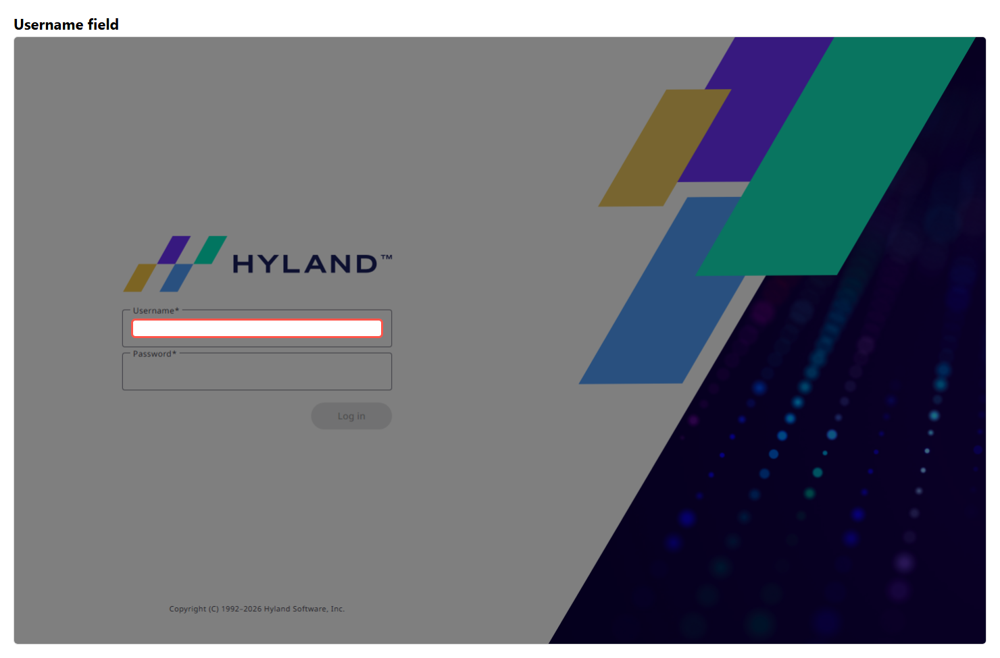
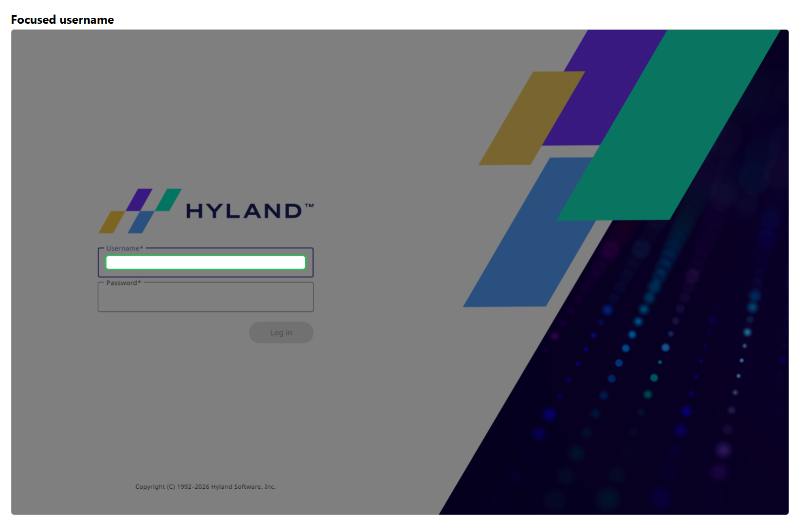
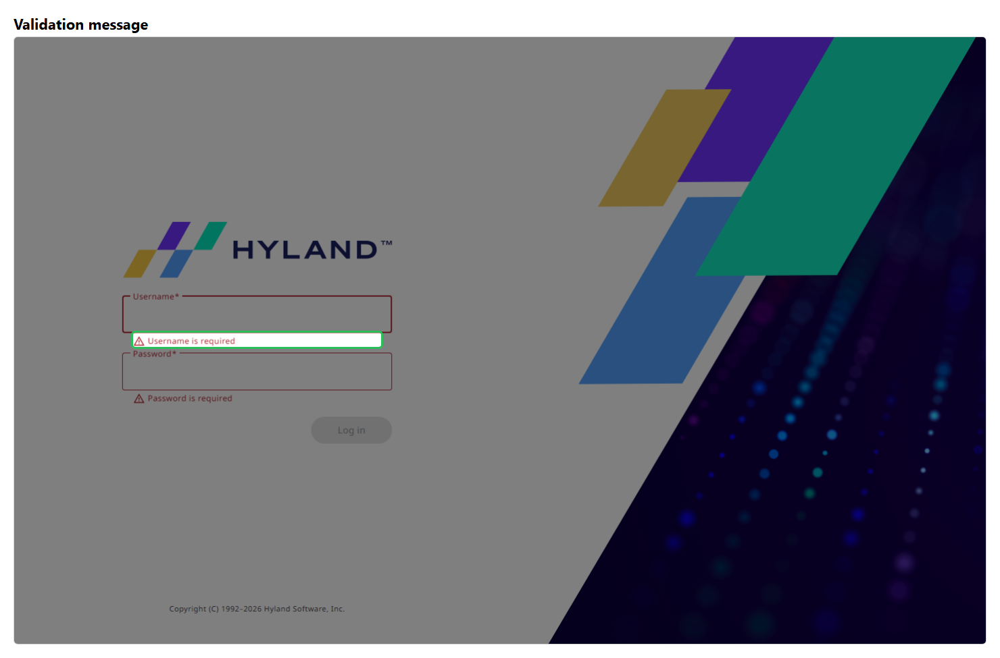

# NXENG-748 — before and after

**Verdict: PASS** — 3 scene(s) compared, 3 of them with no visual difference; a changed assertion carries the proof.

| | Before | After |
| --- | --- | --- |
| Verdict | fail | pass |
| Checks | 9 passed / 11 | 11 passed / 11 |
| Commit | `829feae` | `829feae` |
| Recording | `before/NXENG-748-before.webm` | `after/NXENG-748-after.webm` |

Nuxeo image: _not recorded_

## At a glance

## Scene by scene

### Open the login screen

### Tab to Username and confirm focus is not clipped

### Validation still works on empty submit

## Callouts

## Changes with no visual difference

These scenes produced byte-identical images, which is expected: the change is not
visual. In each, an assertion changed outcome between the halves, and that is the
proof — the picture is context, not evidence.

- `login-context`
- `username-focused`
- `validation-errors`

## Full narratives

- [Before](./before/STORY.md) — the bug as reported
- [After](./after/STORY.md) — the behaviour with the fix

