# NXENG-750 — before and after

**Verdict: PASS** — 4 scene(s) compared, 1 of them with no visual difference; a changed assertion carries the proof.

| | Before | After |
| --- | --- | --- |
| Verdict | fail | pass |
| Checks | 9 passed / 11 | 11 passed / 11 |
| Commit | `b7275dd` | `b7275dd` |
| Recording | `before/NXENG-750-before.webm` | `after/NXENG-750-after.webm` |

Nuxeo image: `nuxeo-recover:clean`

## At a glance

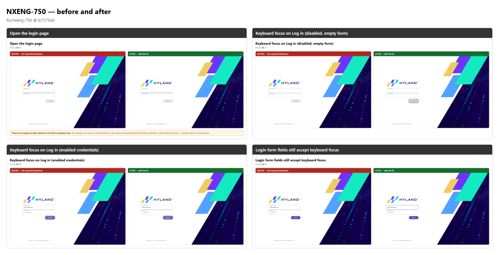

## Scene by scene

### Open the login page

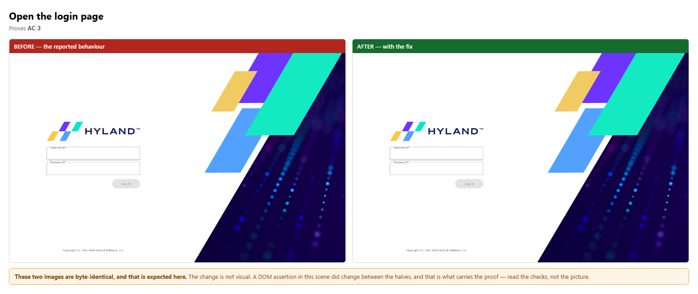

### Keyboard focus on Log in (disabled, empty form)

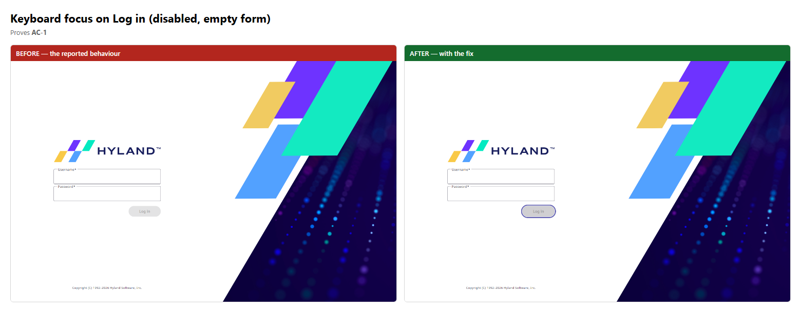

### Keyboard focus on Log in (enabled credentials)

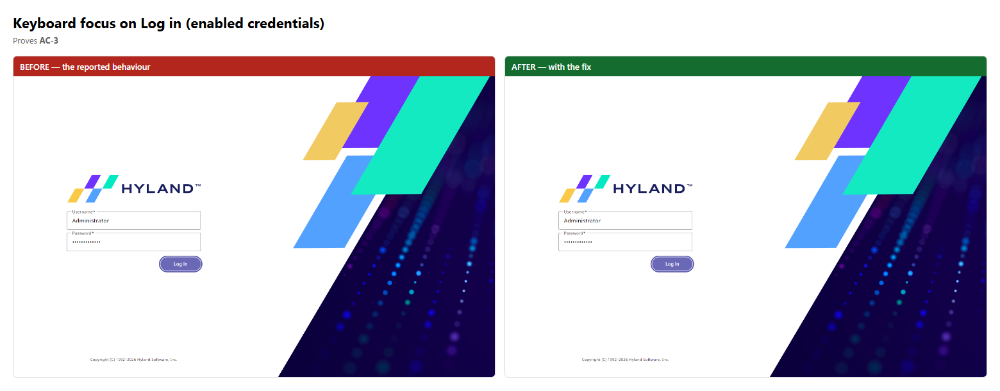

### Login form fields still accept keyboard focus

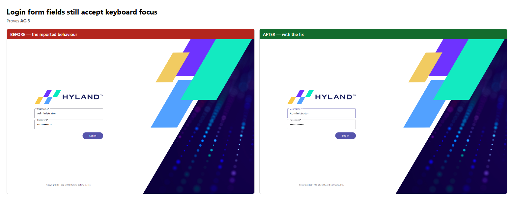

## Callouts

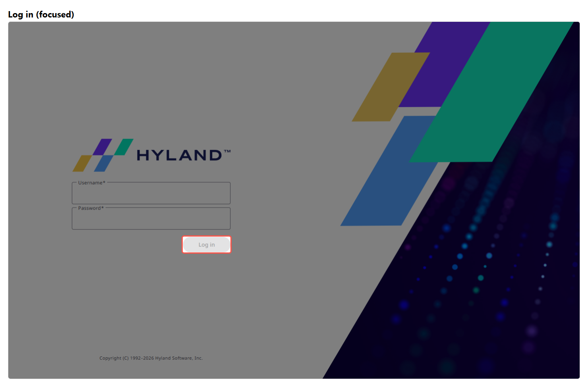

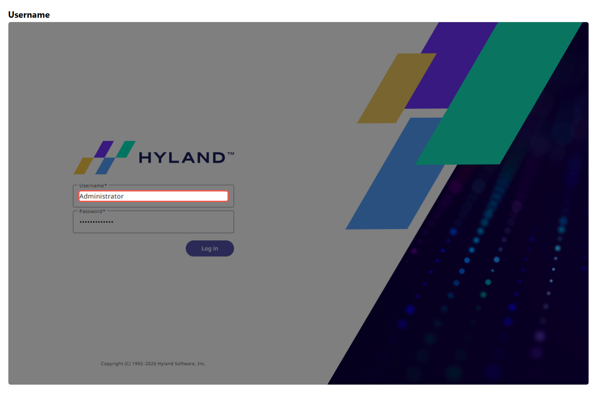

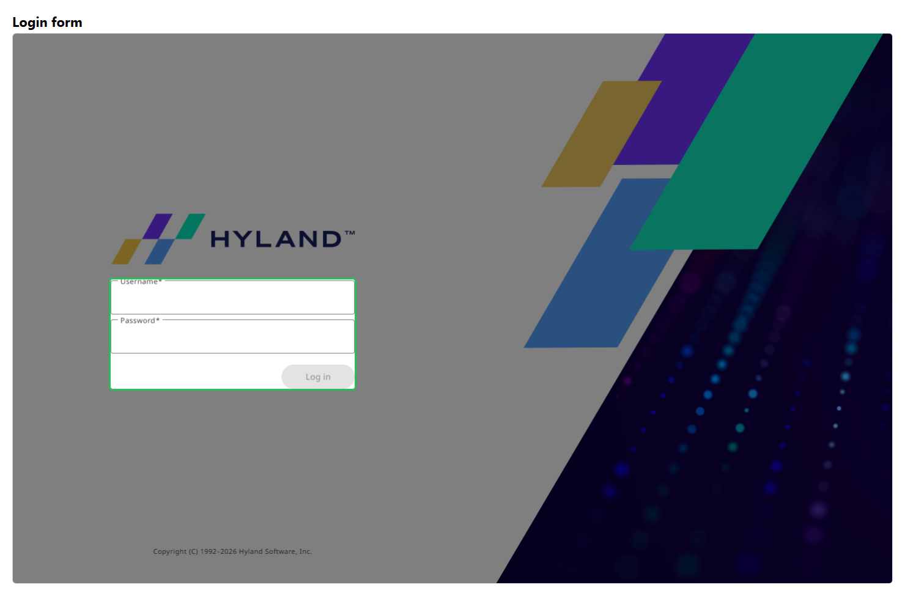

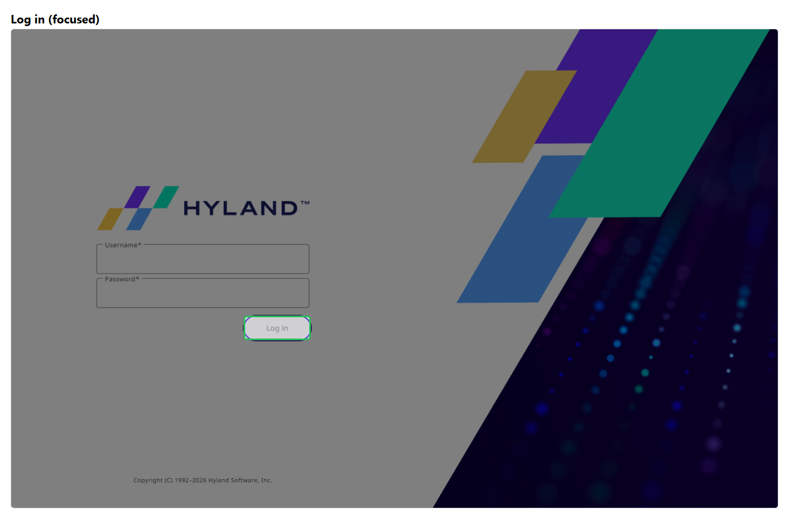

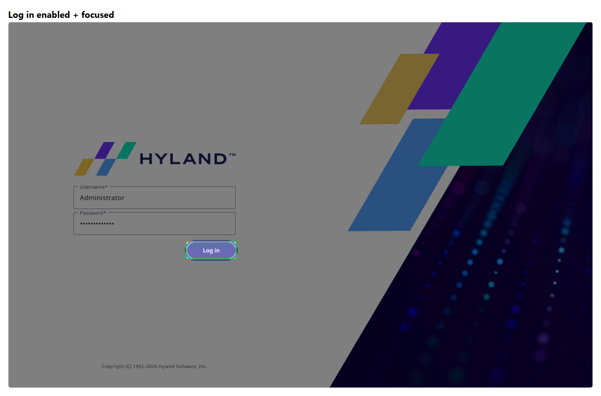

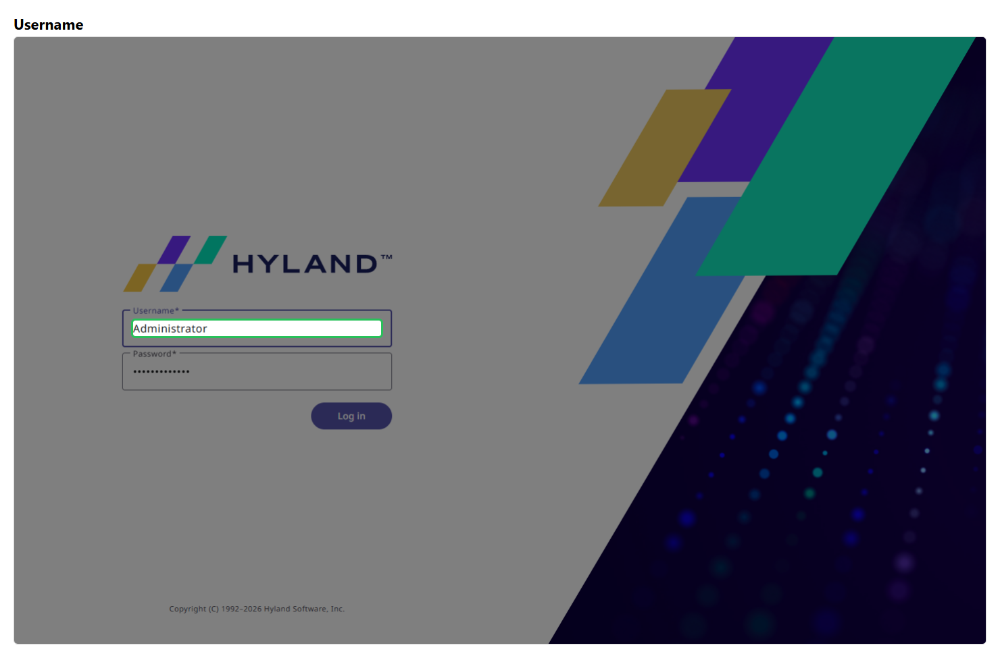

## Changes with no visual difference

These scenes produced byte-identical images, which is expected: the change is not
visual. In each, an assertion changed outcome between the halves, and that is the
proof — the picture is context, not evidence.

- `login-context`

## Full narratives

- [Before](./before/STORY.md) — the bug as reported
- [After](./after/STORY.md) — the behaviour with the fix

