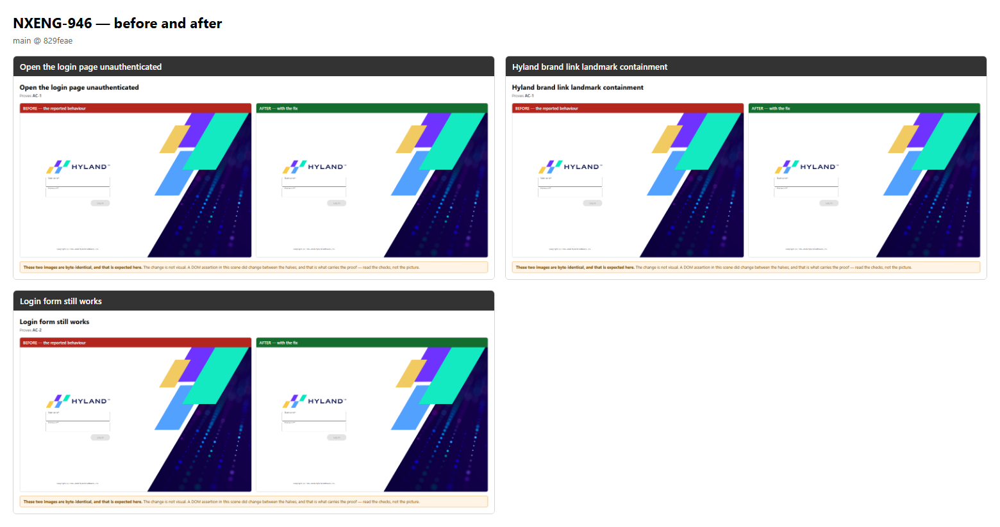
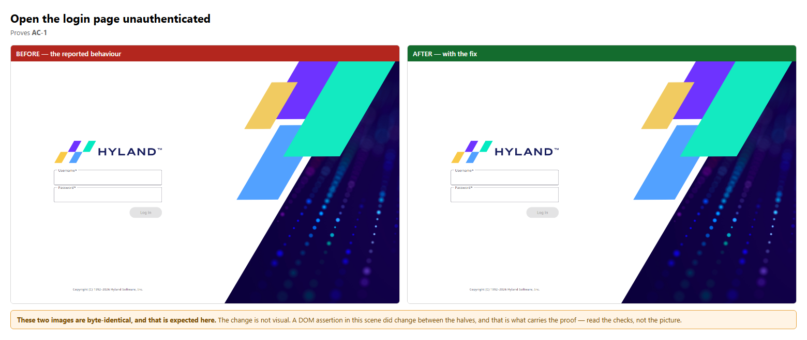
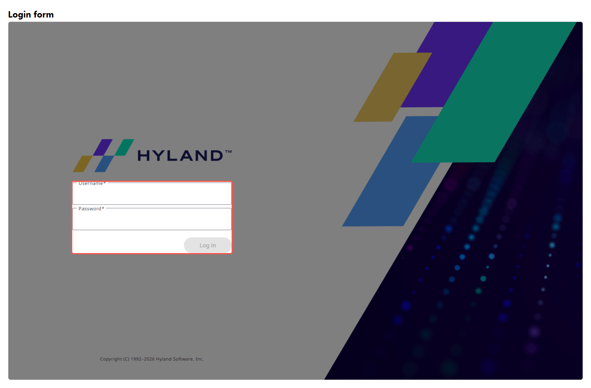
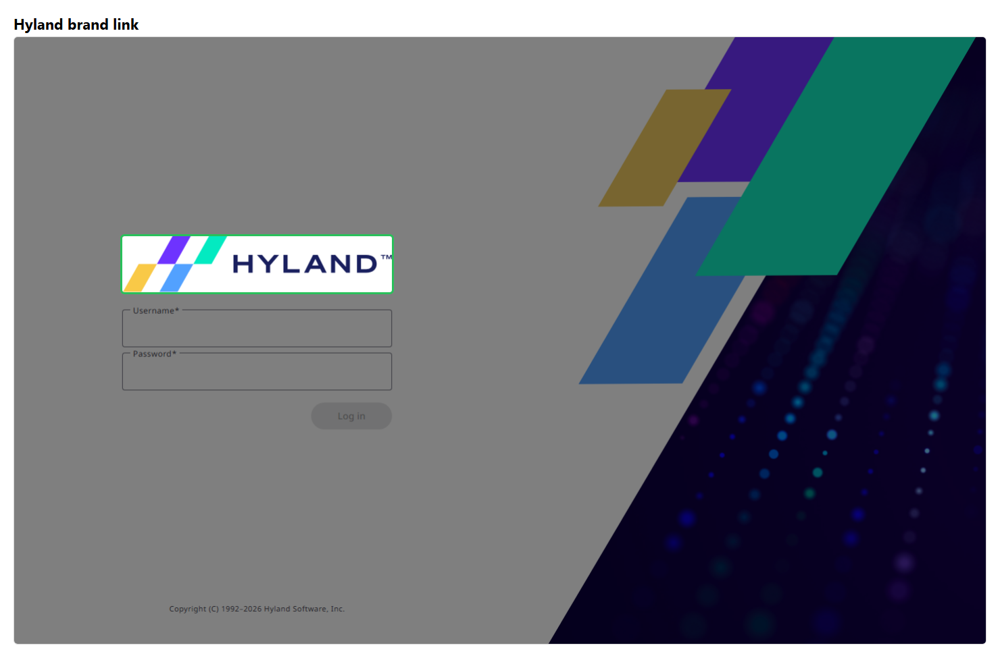

# NXENG-946 — before and after

**Verdict: PASS** — 3 scene(s) compared, 3 of them with no visual difference; a changed assertion carries the proof.

| | Before | After |
| --- | --- | --- |
| Verdict | fail | pass |
| Checks | 8 passed / 9 | 9 passed / 9 |
| Commit | `829feae` | `829feae` |
| Recording | `before/NXENG-946-before.webm` | `after/NXENG-946-after.webm` |

Nuxeo image: `nuxeo-recover:clean`

## At a glance

## Scene by scene

### Open the login page unauthenticated

### Hyland brand link landmark containment

### Login form still works

## Callouts

## Changes with no visual difference

These scenes produced byte-identical images, which is expected: the change is not
visual. In each, an assertion changed outcome between the halves, and that is the
proof — the picture is context, not evidence.

- `login-page`
- `brand-landmark`
- `login-form-intact`

## Full narratives

- [Before](./before/STORY.md) — the bug as reported
- [After](./after/STORY.md) — the behaviour with the fix

