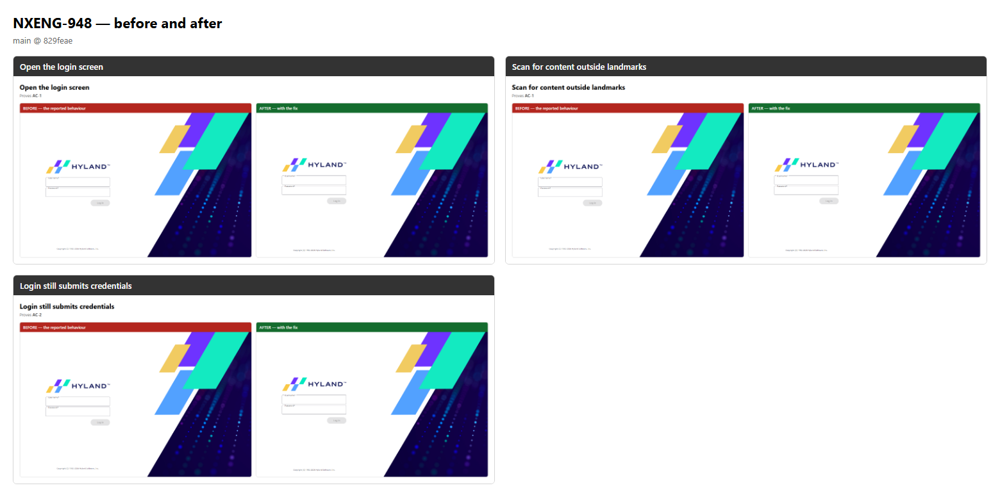
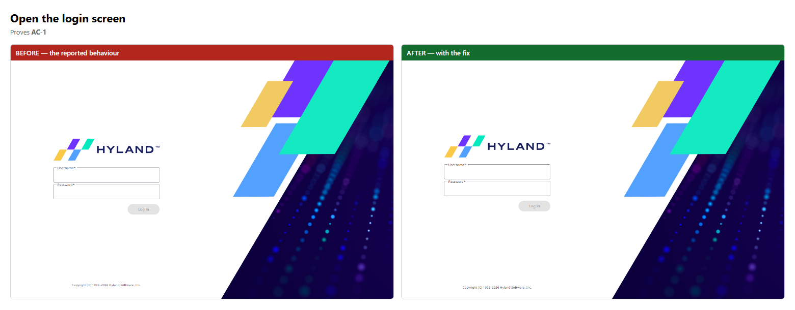
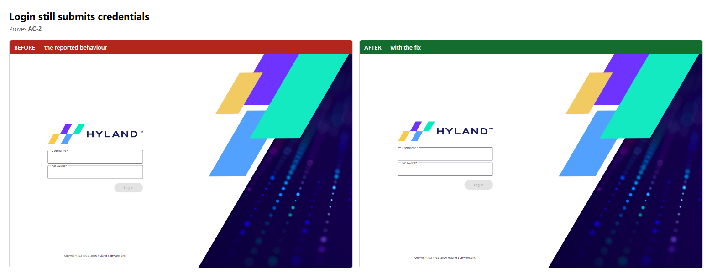
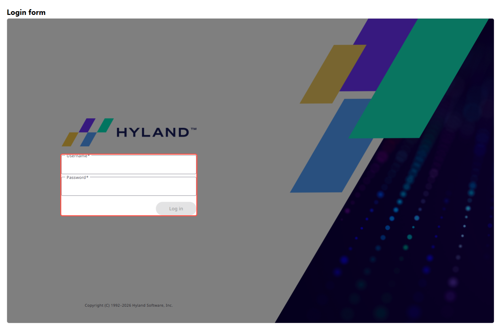
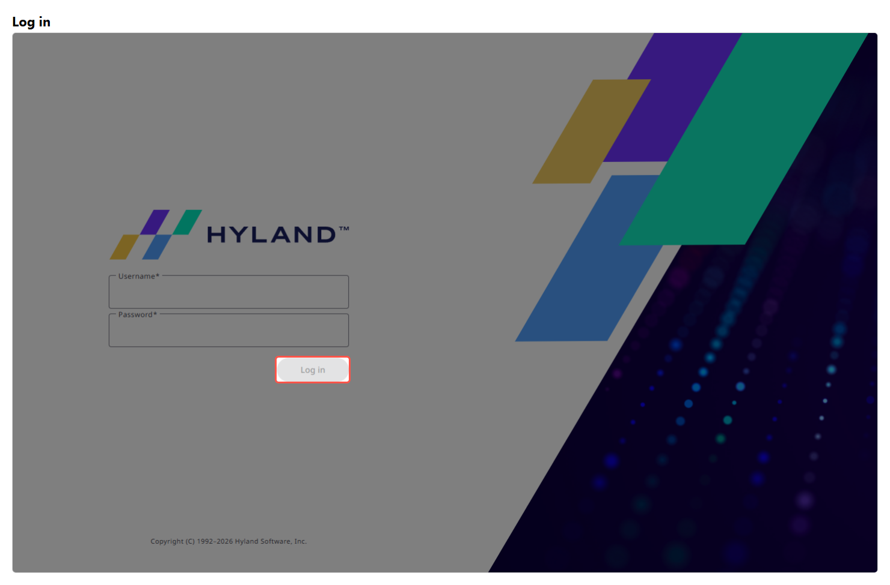
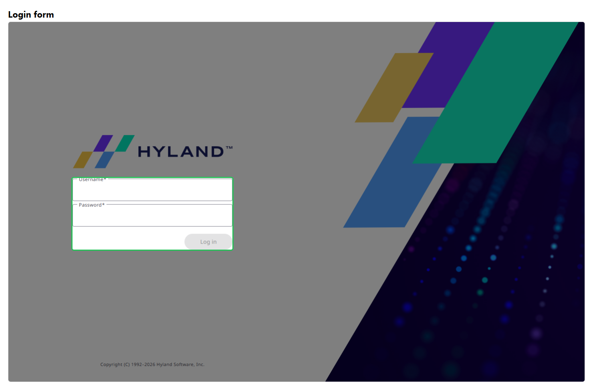
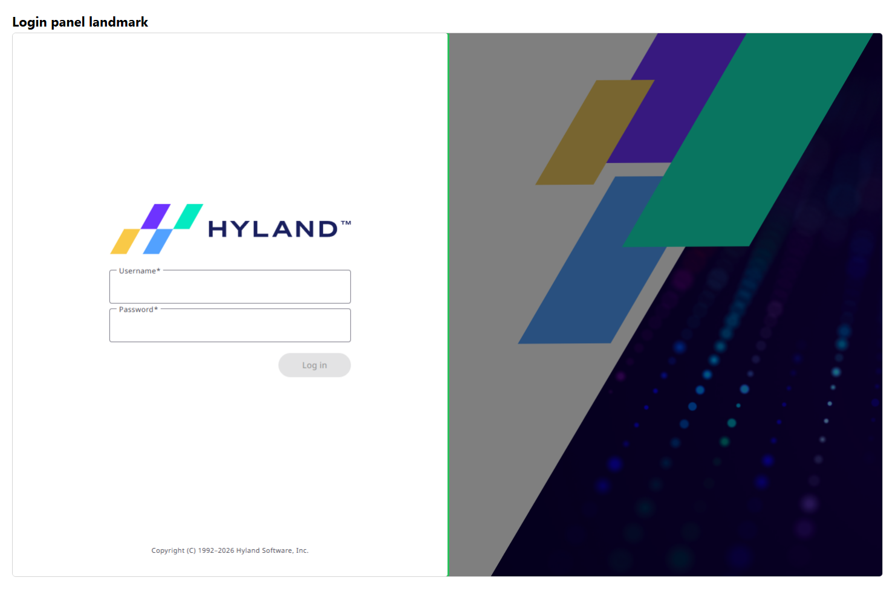
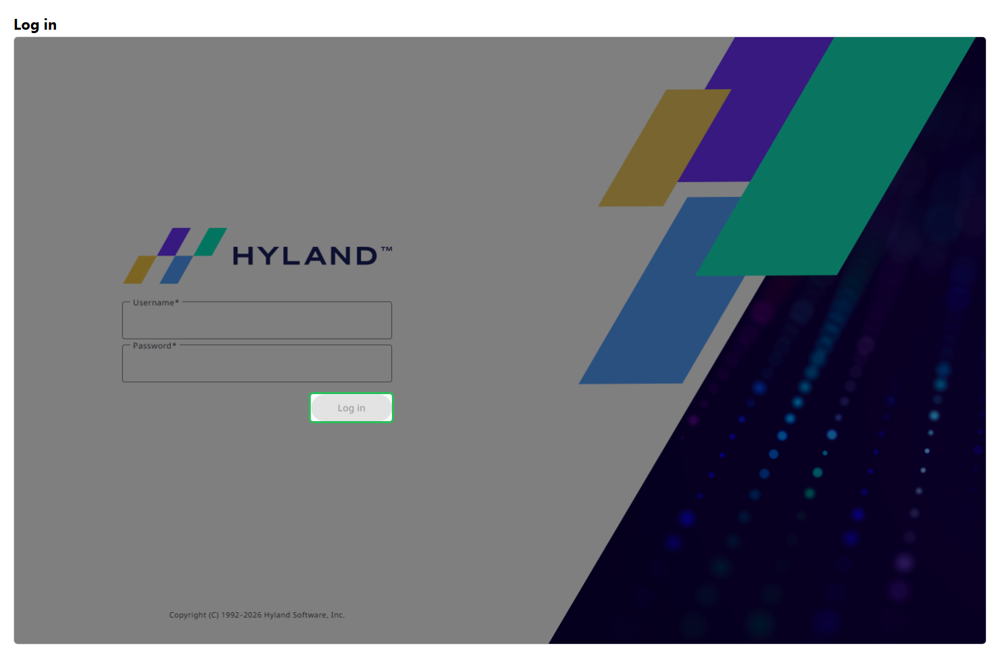

# NXENG-948 — before and after

**Verdict: PASS** — 3 scene(s) compared, every pair visually distinct.

| | Before | After |
| --- | --- | --- |
| Verdict | fail | pass |
| Checks | 7 passed / 8 | 9 passed / 9 |
| Commit | `829feae` | `829feae` |
| Recording | `before/NXENG-948-before.webm` | `after/NXENG-948-after.webm` |

Nuxeo image: `nuxeo-recover:clean`

## At a glance

## Scene by scene

### Open the login screen

### Scan for content outside landmarks

### Login still submits credentials

## Callouts

## Full narratives

- [Before](./before/STORY.md) — the bug as reported
- [After](./after/STORY.md) — the behaviour with the fix

