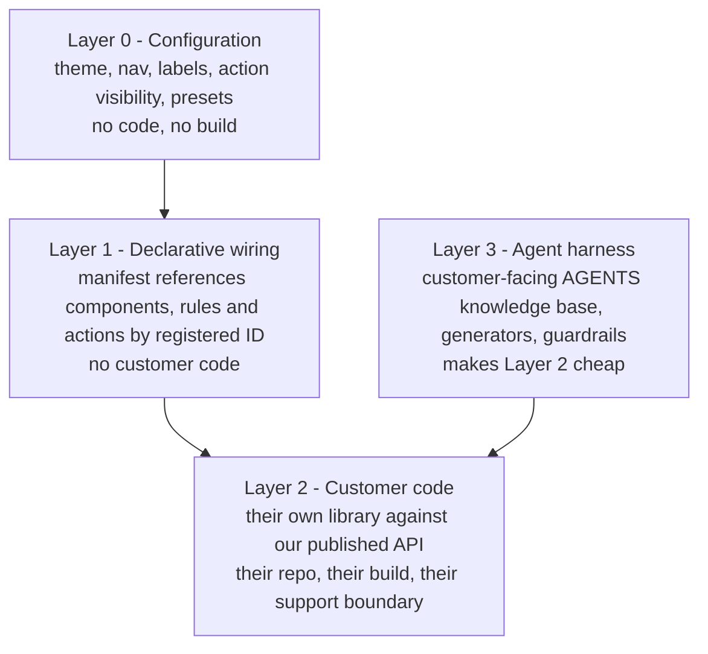
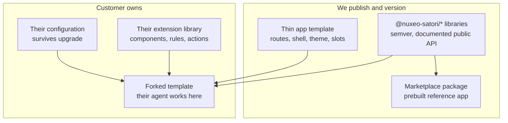

# adf-hx Beta Deliverable — Plan

**Status:** current plan of record · **Last verified:** 20 August 2026
**Tickets:** [NXENG-619](https://hyland.atlassian.net/browse/NXENG-619) under [NXENG-615](https://hyland.atlassian.net/browse/NXENG-615)
**RFC:** "RFC: Nuxeo Satori Beta - Component Platform and Customer Extensibility Model"
**Agent contract:** [`AGENTS/11-beta-program.md`](../AGENTS/11-beta-program.md) · **Harness:** [`scripts/beta-harness/`](../scripts/beta-harness/)

Supersedes [`docs/adf-hx-poc-action-plan.md`](adf-hx-poc-action-plan.md), which was written before the
four-layer extensibility model and before the dependency questions were settled.

---

## Decisions locked

- **adf-hx consumption:** install `@alfresco/adf-hx-content-services` as a real dependency and
  delete the hand-written imitations. No vendoring, no permanent lookalikes.
- **Beta scope:** a deep core slice — browse, folder tree, search, document detail, metadata,
  permissions, versions, upload/CRUD. Workflow, users and groups, administration and publishing
  are out.
- **Customisation model:** a four-layer extensibility contract. AI agents are the authoring
  accelerator for that contract, **not** a licence to edit our source. The contract is the product.
- **Distribution:** versioned libraries plus a thin forkable app template.

## The extensibility contract



Layers 0 and 1 are expected to absorb most customer requests and need no build. Layer 2 exists
because a manifest can only rewire what is already compiled in — ACA's own
`extensions.setComponents({...})` registration confirms this. Layer 3 is the differentiator: the
agent works inside the customer's extension library and the thin template, never in our library
source, which is what preserves the support boundary and the certification claims in NXENG-615.

> **Assumption to validate:** that Layers 0 and 1 cover most requests is a design expectation, not
> a measured fact. Test it against real requests from The Church and one other account before
> Phase 2 fixes the addressable surface.

## Distribution and upgrade model



Upgrades are an npm version bump for the platform, plus occasional small merges in the template.
That is only true if the public API is genuinely stable — see the encapsulation rule in Phase 3.

### Where configuration lives

The marketplace installer is destructive today:

```xml
<copy dir="${package.root}/web" todir="${env.server.home}/nxserver" overwrite="true" />
```

So configuration must not live inside the packaged `web` directory. Split it:

- **Bootstrap config** (pre-auth: Nuxeo server URL, base href, branding shell, manifest location)
  on a static path the installer does not overwrite, requiring a second non-overwriting copy step
  in [`nuxeo-agentic-ui-package/src/main/resources/install.xml`](../nuxeo-agentic-ui-package/src/main/resources/install.xml).
- **Runtime manifest** (nav, actions, rules, presets, toggles) as a **Nuxeo document** at
  `/default-domain/config/agentic-ui`, fetched through the existing authenticated `HttpClient`,
  with the packaged default as fallback. This inherits Nuxeo versioning, audit, ACLs and per-tenant
  scoping for free, and can be edited from the app itself.

---

## Verified facts (established 20 August 2026)

Settled by first-hand inspection. Do not re-litigate; if you contradict one, prove it first.

- **The package is installable.** A token with scope `read:packages` resolved and downloaded
  `@alfresco/adf-hx-content-services` — a 379,417-byte tarball of 285 files, checksum verified.
- **648 published versions.** `latest` = `7.20.0-automate.292` (19 Jan 2026), `beta` =
  `7.21.0-automate.86` (19 Jun 2026). The earlier "v0.0.8" figure was a stale placeholder in source
  control and was wrong.
- **No stable release in twelve months.** The last true stable, `7.19.5` (21 Aug 2025), declares an
  Angular 15 baseline and predates the surface this plan depends on. We pin an exact prerelease.
- **Twelve API ports are overridable injection tokens, verified in the shipped artifact** —
  `CHECKIN`, `COPY`, `DOCUMENT`, `DOWNLOAD`, `GROUP`, `MODEL`, `MOVE`, `QUERY`, `RENDITIONS`,
  `UPLOAD`, `USER`, `VERSION`, plus `ADF_HX_CONTENT_SERVICES_API_PROVIDERS`. This is the mechanism
  the whole plan rests on.
- **The dependency contract is under-declared:** one peer declared (`@angular/core`) against
  thirteen actually imported, including `@angular/material` at 48 import sites and
  `@alfresco/adf-core` at 10. `npm install` will not warn. Test artifacts also ship — `ng-mocks` in
  a bundle, and a mock exported from the public `/api` entry point.
- **`@alfresco/adf-extensions@9.0.0` is on public npm**, runtime dependency `tslib` only, so
  Layers 0 and 1 need no privileged access. `@alfresco/js-api` is a mandatory peer of both
  adf-extensions and adf-core.
- **The published component surface is richer than first catalogued:** `HxpDocumentListComponent`,
  `HxpDocumentTreeComponent`, `HxpBreadcrumbComponent`, `HxpMetadataSidebarComponent`,
  `HxpPropertiesSidebarComponent`, `ManageVersionsSidebarComponent`, `HxpUiDocumentViewerComponent`,
  permissions dialogs and panels, content share and delete, column management, search filters —
  several with companion `*-action.service` classes reusable in the Layer 1 action registry.
- **Nothing in this repo uses a real adf-hx component.** No `@alfresco/*` dependency is declared,
  locked or installed; zero `@alfresco` imports in source; all 22 `hxcs-js-client` imports are
  `import type`; all 15 `hxp-*` components are declared locally in `libs/shared/adf-hx-bridge`.
- **The branch is sound.** `npm ci` succeeds; installed versions match HFA `develop` exactly
  (Angular 20.3.27, Material 20.2.14, TypeScript 5.8.3, Satori 0.2.0, hxcs-js-client 2.0.111);
  guardrails, lint and build all pass; 280 of 281 tests pass.

---

## Already done

- Phase 0 verification: dependencies install, gates run, build passes (1.66 MB initial bundle).
- Much of Phase 5: [`scripts/beta-harness/`](../scripts/beta-harness/) (phase evidence runner with
  per-step assertions, verification gate, annotated comparison generator),
  [`AGENTS/11-beta-program.md`](../AGENTS/11-beta-program.md), the `beta-program` rule, and six SDLC
  skills (`beta-phase`, `verify-gate`, `capture-phase-evidence`, `implement-api-port`,
  `adopt-adf-hx-component`, `add-extension-point`).
- Baseline evidence against live Nuxeo: 13/13 checks; showcase artifact 18/18.
- Documentation corrected for the AI backend having moved to its own repo.

---

## Phase 0 — Verify and unblock (1-2 d remaining)

1. ~~Obtain a `read:packages` token.~~ Done. **Provision it as a long-lived CI secret** — CI still
   cannot install without it.
2. Resolve the scope conflict in [`.npmrc`](../.npmrc): all of `@alfresco` routes to
   `npm.pkg.github.com`, but adf-core and adf-extensions come from public npm while adf-hx comes
   from GitHub Packages. npm resolves per scope, not per package.
3. Fix the harness authentication defect: `helpers.login()` injects a session that satisfies the
   route guard but does not reliably authenticate XHRs, producing intermittent `403`s on
   `/nuxeo/api` paths. Use Playwright `httpCredentials`, as
   [`annotate-showcase.mjs`](../scripts/beta-harness/annotate-showcase.mjs) now does.
4. Fix the Node-version test failure: `clipboard.utils.spec.ts` fails on Node 22+ because Node's
   built-in experimental `localStorage` collides with jsdom. CI runs Node 20, contributors do not.
5. Triage the **9 high-severity `npm audit` findings**. NXENG-615 requires no high or critical, and
   the surface grows once adf-core arrives.
6. Delete the unused Material `hxp-document-tree` and open a draft PR so CI runs at all.

## Phase 1 — Layer 0: upgrade-safe configuration (12-18 d, unblocked)

- Add the non-overwriting config path to `install.xml`, and a bootstrap config fetched by an
  `APP_INITIALIZER` in [`apps/nuxeo-ui/src/app/app.config.ts`](../apps/nuxeo-ui/src/app/app.config.ts).
  Repoint the existing 12+ `InjectionToken` factories (`nuxeo-api.config.ts`, `ai.config.ts`,
  `kd.config.ts`, `adf-hx-bridge.tokens.ts`) at it — the token pattern is already the intended
  override idiom, so this converts the set in one move.
- Load the runtime manifest from the Nuxeo config document, with packaged fallback and tolerant
  failure.
- **Theming:** replace the four hardcoded `html[data-app-theme=...]` blocks in
  [`apps/nuxeo-ui/src/styles.scss`](../apps/nuxeo-ui/src/styles.scss) with config-driven CSS custom
  properties, and delete the `!important` override block that would otherwise fight customer CSS.
- **i18n:** activate the inert `TranslateModule` and extract strings **for the slice only**.
  Full-repo extraction is an 8-12 d task and is not Beta-critical.

## Phase 2 — Layer 1: extension registry (15-22 d, unblocked)

Add `libs/shared/extensions` wrapping `@alfresco/adf-extensions`.

- **Rules:** register the pure predicates in
  [`libs/shared/nuxeo-client/src/lib/utils/document-permissions.ts`](../libs/shared/nuxeo-client/src/lib/utils/document-permissions.ts)
  (`canWriteDocument`, `canRemoveDocument`, `canAddChildren`, `canManageDocumentPermissions`) as
  named evaluators. They are already the right shape, just called inline from templates.
- **Navbar, sidebar and routes:** convert `PLATFORM_NAV_ITEMS` in
  [`apps/nuxeo-ui/src/app/platform-nav-items.ts`](../apps/nuxeo-ui/src/app/platform-nav-items.ts)
  from a compiled `const` to a manifest-fed token, and remove the ~15 hardcoded path getters in
  [`nav-drawer.component.ts`](../apps/nuxeo-ui/src/app/shell/nav-drawer/nav-drawer.component.ts)
  that currently make a manifest-added nav item render an empty drawer. Feature libs already export
  `Routes` arrays, so route injection is one indirection.
- **Actions:** the largest refactor. Convert the hardcoded toolbar, the seven-item overflow menu and
  the five hardcoded `mat-tab` children in `document-detail.html` (2,000+ lines), plus the six fixed
  `@Output()` buttons in `selection-topbar.component.html`, into declarative action descriptors
  resolved through the registry. Reuse adf-hx's `*-action.service` pattern rather than inventing one.
- Generalise and export the working `DynamicDrawerComponent` (`Type<unknown>` to
  `createComponent()`) as the shared component-resolution primitive that route, tab, viewer and
  drawer extensions all need.
- Implement `$references` merge so customer JSON layers over ours.

## Phase 3 — adf-hx adoption (30-45 d)

**Real components, not imitations.** Swap in one at a time behind `/#/browse-adf-hx`, deleting each
hand-written `hxp-*` equivalent in the same change. Order: `document-list`, `breadcrumb`,
`document-tree`, `metadata-sidebar`, `permission`, `manage-versions` (a capability the POC lacks
entirely), `document-viewer`, `search`.

`HxpDocumentListComponent` is a **go/no-go spike**, not the first of a batch. Its inputs are typed on
the HxPR SDK `Document` and the upstream neutral-type work has not started, so mapping fidelity is
the real risk. Re-baseline the rest of the phase from what the spike measures.

Scope note: the bridge implements 2 of the 12 API ports. The Beta slice needs roughly ten —
document, query, upload, version, download, renditions, user, group, move, copy.

**Hard rules for this phase:**

- Import the **upstream** API tokens and delete the bridge's local clones (`DOCUMENT_API_TOKEN`,
  `QUERY_API_TOKEN`, `ROOT_DOCUMENT`, `DEFAULT_REPOSITORY_ID`). Angular resolves by token identity,
  so the clones do not satisfy adf-hx components.
- **Pin an exact prerelease version.** Never a range, never a dist-tag — `latest` is itself a
  prerelease.
- Maintain our own pin manifest for the thirteen undeclared peers.
- **adf-hx types must never appear in our public API signatures**, enforced by a lint or
  API-extractor gate.
- Update `.cursor/rules/adf-hx-browse-poc.mdc`: its ban on Material was written for hand-built
  components and adf-core brings Material in transitively.

Fix the bridge defects in the same phase, since adf-hx components consume the mapped documents:
hardcoded `sys_effectivePermissions`, the silently dropped sort, the overwritten `totalCount`, the
50-child ceiling with no pager, and the `browse_column_settings` localStorage collision.

## Phase 4 — Layer 2: publishable platform (18-26 d)

- Give the libraries real build targets with ng-packagr. Today every `project.json` has only `lint`
  and `test`, and the only artifact is a prebuilt SPA zip — there is nothing for a customer to
  depend on.
- **Declare the public API surface and a semver policy**, with an automated gate so internal types
  cannot leak into it. This is what makes upgrades a version bump rather than a merge.
- Expose the registration API — our equivalent of `setComponents`, `setEvaluators` and
  `setAuthGuards` — so customer code can contribute by ID.
- Build the thin forkable app template and a customer extension-library starter.

## Phase 5 — Layer 3: agent harness (4-6 d remaining)

Largely built. Remaining:

- Split the `AGENTS/` knowledge base into internal and customer-facing halves, and version the
  customer-facing half as a product artifact.
- Add Nx generators for "new extension component", "new action", "new rule".
- Package the guardrail script for customer use.

## Phase 6 — Beta quality bar and proof (20-30 d)

- NXENG-615's checklist, assessed against the slice: unit coverage above 90% (the bridge has 11
  tests for 2,949 lines today), Playwright E2E on critical paths, WCAG 2.1 AA, SAST and SCA clean,
  Chrome and Safari verified.
- **Reference customer extension** exercising Layers 0-2 — a nav item, a rule-gated action, a custom
  component and a rebrand — with zero edits to our libraries.
- **Upgrade rehearsal:** install, customise, upgrade, and verify configuration and extensions both
  survive. This is the test that actually proves the model.

---

## Timeline

| Phase                  | Focused       | With AI support |
| ---------------------- | ------------- | --------------- |
| 0 — Verify and unblock | 1-2 d         | 1 d             |
| 1 — Layer 0 config     | 12-18 d       | 7-11 d          |
| 2 — Layer 1 registry   | 15-22 d       | 9-14 d          |
| 3 — adf-hx adoption    | 30-45 d       | 20-29 d         |
| 4 — Layer 2 platform   | 18-26 d       | 11-16 d         |
| 5 — Layer 3 harness    | 4-6 d         | 2-4 d           |
| 6 — Quality and proof  | 20-30 d       | 12-18 d         |
| **Total**              | **100-149 d** | **62-93 d**     |

Roughly 5-7 months focused, or 3-4.5 months with AI support. These are engineering judgements
calibrated against this branch, not measurements; re-baseline after the Phase 3 spike, which is the
first task with a comparable prior.

Against the Q3/Q4 2026 Beta target, only the AI-supported pace fits. **If it slips, gate Beta on
Phases 0-3 plus 6** — Layers 0 and 1, the adf-hx slice and the quality bar — and follow with Layers
2 and 3 for GA. That still ships a configurable, upgrade-safe, adf-hx-based product and defers only
customer-authored code.

## Risks

| #   | Risk                                                                                                                                                                                                                                                          | Severity | Mitigation                                                                                  |
| --- | ------------------------------------------------------------------------------------------------------------------------------------------------------------------------------------------------------------------------------------------------------------- | -------- | ------------------------------------------------------------------------------------------- |
| R1  | **No stable adf-hx release in twelve months.** `latest` is a prerelease; the last stable is a year old on an Angular 15 baseline. We would ship an enterprise product on a prerelease channel.                                                                | High     | Pin an exact prerelease. Open a supported-release conversation with CSX.                    |
| R2  | **Dependency contract under-declared** — 1 peer declared against 13 imported — and test artifacts ship in the bundle. Incompatibilities surface at build or runtime, not install time.                                                                        | High     | Own pin manifest, contract tests on all twelve ports, raise the packaging defects upstream. |
| R3  | **Render fidelity unproven.** Provider substitution is verified; that real components render correctly against Nuxeo-mapped documents is not. Mapper approximations (hardcoded permissions, `sys_name` as title, state from `dc:nature`) may surface visibly. | High     | `document-list` is a go/no-go spike before committing to the rest.                          |
| R4  | `@alfresco/js-api` and the wider adf-core peer set (including `pdfjs-dist`, `@mat-datetimepicker/core`) ship inside a Nuxeo product.                                                                                                                          | Medium   | SCA, licensing and product-optics review before Phase 3 commits.                            |
| R5  | **9 high-severity audit findings already**, before adf-core arrives. NXENG-615 requires none.                                                                                                                                                                 | Medium   | Triage in Phase 0.                                                                          |
| R6  | This branch carries the monorepo Angular 20 upgrade while `main` is on 19.                                                                                                                                                                                    | Medium   | Land the upgrade as its own PR first.                                                       |
| R7  | Manifest-as-Nuxeo-document and the non-overwriting installer change need packaging sign-off; neither is prototyped.                                                                                                                                           | Medium   | Spike in Phase 1; fall back to a static path outside `nxserver/web`.                        |
| R8  | Too few addressable IDs in Layer 1 caps customisation and pushes work into Layer 2, undermining the maintenance economics.                                                                                                                                    | Medium   | Fix the addressable surface before Phase 2 starts, informed by real customer requests.      |
| R9  | Selection state is shared with production browse, so the Satori bulk topbar overlays the POC route.                                                                                                                                                           | Low      | Decide whether Beta keeps one shell or forks it.                                            |
| R10 | The `@nuxeo-satori` npm scope is proposed but ownership is unconfirmed.                                                                                                                                                                                       | Low      | Confirm or choose an owned scope in Phase 4.                                                |

## Still open

- Who owns the `read:packages` CI secret?
- Which exact adf-hx version do we pin — the January `latest` prerelease, or the June `beta`, which
  is closer to the surface verified in `develop`?
- Does Beta ship as a marketplace package, an npm library set, or both? Phase 4 assumes both.
- Do we keep `/#/browse-adf-hx` as a parallel route through Beta, or cut over `/#/browse` once
  parity is reached?
- How much of the app becomes addressable by ID in Layer 1? That sets the ceiling on what any
  manifest can ever express, and retrofitting it means redoing the action registry.
- What is the supported Nuxeo LTS matrix for Beta, which determines the contract-test grid?
