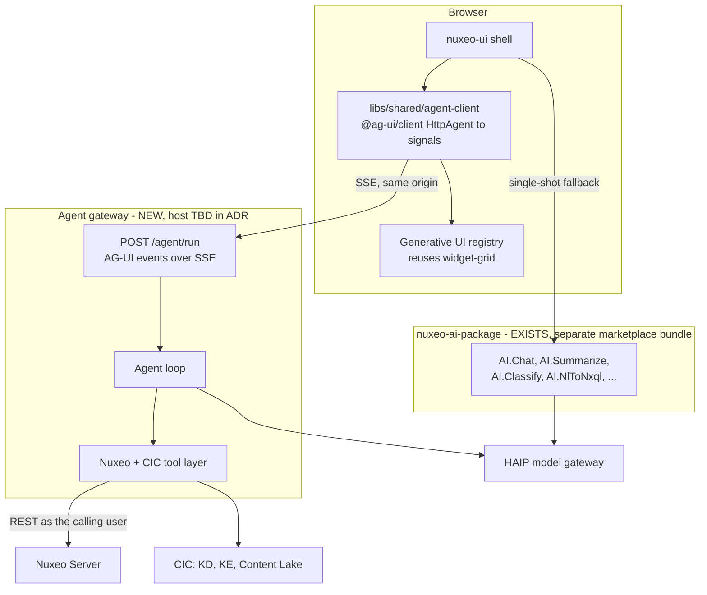

# Nuxeo Satori Agentic Beta — Engineering Plan

> **Provenance.** This is the durable in-repository record of the live plan held at
> `.cursor/plans/satori_agentic_beta_a8e460a8.plan.md`, which remains the working source of truth
> for day-to-day task status. Content and structure follow that file. Corrections that existed
> only in the published Confluence copy — [Nuxeo Satori Agentic Beta — Engineering Plan](https://hyland.atlassian.net/wiki/spaces/~71202090f2a61ef96d4f57a5104efe296c1f5b/pages/4230974026),
> version 5 — have been carried across: the corrected source line counts, the re-specified B1, the
> B2 entry-point constraint, the new B4 adapter-ownership task, the two ADF HX risks, and the
> traceability rule. The Confluence copy's status line ("parked pending leadership approval, no
> code has been written") is stale and has not been carried over; several tasks below are done.

> **Status:** In execution against a plan still awaiting formal leadership approval. Task status is in the snapshot at the end of this document.
> **Parent:** [Nuxeo Satori Beta — Product Overview](beta-product-overview.md)
> **Sibling:** [ADF HX Content Services vs. a Nuxeo Satori Library — Decision Document](adf-hx-vs-nuxeo-satori-decision.md)

Take the Agentic POC to a feature-rich Beta by adding a real AG-UI streaming agent runtime, reshaping `libs/` into a publishable Nuxeo component library aligned to the CSX-447 port surface, and closing the NXENG-615 quality gates (tests, E2E, a11y, SAST/SCA, CI).

---

## Context and the gap we are closing

The POC is far more complete than its name suggests — 9 feature libs and 7 shared libs, ~46k lines of source excluding tests — but three things block a feature-rich Beta:

- **There is no agent runtime.** Today's AI features are single-shot RPC: the UI posts to Nuxeo Automation operations (`AI.Chat`, `AI.Summarize`, …) served by the standalone [nuxeo-ai-package](https://github.com/nuxeo/nuxeo-ai-package) Java bundle. That split is deliberate and stays. What it cannot do is stream, run multi-step tool loops, pause for human approval, or hold a durable conversation — so nothing streams, chat history is an in-memory signal wiped on reload, and Knowledge Discovery fakes progress with a 1.5s poll.
- **There is no reusable library.** Everything is app-shaped under `libs/features/` and `libs/shared/`, with no abstraction boundary and no publishable artifact.
- **The quality bar is far away.** 54 spec files total, 5 libs with zero, `trash` with no test target, `ai-client` with no Nx targets, no Playwright, and CI that tests 4 of 18 projects.

Note a scope conflict to resolve with the epic owner: [NXENG-615](https://hyland.atlassian.net/browse/NXENG-615) lists "JIT/agentic runtime UI" and "any NEW functionality not currently in the POC" as **out of scope for Beta**, while the program overview puts AG-UI under v1. This plan treats the agentic layer as an in-scope, feature-flagged differentiator, but the epic text needs amending so the Beta definition of done does not contradict it.

## Target architecture

Two decisions worth stating up front:

- **The gateway never holds credentials of its own.** It is reverse-proxied same-origin so the Nuxeo session cookie flows through, validates the caller with `GET /nuxeo/api/v1/me`, and forwards that identity on every downstream Nuxeo call. An agent that queried with a service account would silently cross ACL boundaries — this is the single most important security property of the design.
- **The existing Automation path stays as a graceful fallback.** If the gateway is not deployed (a real OnPrem scenario), the app degrades to today's request/response AI rather than breaking. `AiFeatureFlagService` gains an agent-runtime capability probe alongside the existing `aiEnabled()` flag.

---

## Track A — AG-UI agent runtime

### A1. ADR and spike

Write `docs/adr/001-agent-runtime.md` covering transport (SSE over same-origin `/agent/*`), identity propagation, thread persistence, and the OnPrem deployment story. Spike a hello-world AG-UI stream end to end before building anything else.

### A2. The agent gateway

**Open decision — where this lives.** The team already set a precedent by moving AI capability out of this monorepo into the standalone [nuxeo-ai-package](https://github.com/nuxeo/nuxeo-ai-package) Java bundle, which deploys cleanly to Cloud and OnPrem as a single marketplace artifact. Putting the agent runtime back inside this repo as a Node app cuts against that, and reintroduces the sidecar deployment problem the migration solved. Two candidates:

- Extend `nuxeo-ai-package` with an AG-UI SSE endpoint (Java, community AG-UI SDK). Consistent with precedent, one deploy artifact, no OnPrem story to invent.
- New standalone TypeScript service, either in this repo as `apps/agent-gateway` or in its own repo. First-class AG-UI SDK support, but a second runtime to deploy.

Resolve this in A1 before writing code.

Whichever host wins, the contract is the same: a single endpoint `POST /agent/run` accepting `RunAgentInput` and returning `text/event-stream`, emitting `RUN_STARTED`, `TEXT_MESSAGE_CHUNK`, `TOOL_CALL_CHUNK`, `STATE_DELTA`, `RUN_FINISHED` / `RUN_ERROR`. Config strictly from environment with startup validation and no fallback defaults, per `AGENTS/07-security.md`.

### A3. Tool layer

Server-side tools calling Nuxeo REST as the authenticated caller. These replace the flattened, JSON-stringified Automation params (`historyJson`, `commentsJson`) in `libs/shared/ai-client/src/lib/ai-gateway.service.ts` with real typed tool calls.

**Read tools:** NXQL search, fetch document, list children, find similar, KD ask via the CIC connector, read ACLs (`getPermissions` / the `acls` enricher), read audit history, detect audit anomalies.

**Write tools, all gated behind approval:** tag, classify, summarize, update metadata (single and bulk), move document to folder, create collection, add to collection, save a search, trigger Knowledge Enrichment on a document.

Every tool in the write list maps onto a service method that already exists, so the work is wrapping and typing rather than new Nuxeo integration: `createCollection`, `addToCollection` and `replacePermission` in `document-detail.service.ts`, `updateDocument` in `browse.service.ts`, `saveSearch` in `trash.service.ts`. The one genuinely new call is document move (`Document.Move`).

This tool set is what the A8 recipes and the section 4 personas on the product overview require. Adding a promise to that page means adding the tool here first.

Frontend-defined tools passed in `RunAgentInput.tools` for anything needing human judgment: `confirmAction`, `navigateTo`, `applyMetadata`, `selectDocuments`.

**Public tool registration.** Expose tool registration as a documented extension point so a customer can add their own tools, since Level 4 of the product overview promises exactly that.

### A4. `libs/shared/agent-client`

Angular wrapper over `@ag-ui/client`'s `HttpAgent`. Because the SDK is RxJS 7.8.1 — the same version this repo pins — this is a thin `AgentSubscriber` to signals adapter, no React and no CopilotKit.

Exposes signals for `messages`, `streamingText`, `toolCalls`, `thinkingSteps`, `sharedState`, `running`, plus `abortRun()`. Replaces `libs/shared/ai-client/src/lib/ai-chat.service.ts`, whose `send()` currently resolves in a single `HttpClient.post`.

### A5. Chat surface rebuild

The chat panel is currently inline in the shell at `apps/nuxeo-ui/src/app/shell/app-shell.component.html` (lines 127–332). Extract it into a proper component and add token streaming, thinking-step display, tool-call cards, human-in-the-loop approval prompts, cancel, and grounded citations. Keep the existing `ai-markdown.pipe.ts` rendering path and its sanitisation.

### A6. Thread persistence

Store threads as Nuxeo documents in the user's workspace so no new datastore is introduced. Because they are ordinary documents, thread sharing reuses the existing permissions dialog rather than needing a bespoke sharing surface — wire that up explicitly, since the product overview promises shareable threads.

This also fixes the KD feedback bug, where `submitFeedback()` currently mutates a local `Map` and returns `of(undefined)` without ever reaching upstream. Until it is fixed, no Knowledge Discovery feedback has ever left the browser.

### A7. Generative UI and shared state

The "adaptive layout" item from the program page. The agent proposes typed, app-validated widgets rendered through a component registry built on the existing `libs/shared/ui/src/lib/widget-grid/` and `widget-container/`. Shared state via `STATE_DELTA` lets the agent drive search filters and selection, with the app remaining the validator — the agent proposes, the app mounts.

Make the registry a **public extension point**, not an internal detail, so customers can contribute their own widgets as Level 4 of the product overview promises. This also delivers the "ad-hoc reporting" use case directly, without needing a recipe for it.

### A8. Recipe framework and three flagship recipes

Recipes are the mechanism by which section 5 of the product overview becomes real. Without this task the page promises capability nobody is building.

Build a declarative recipe definition — goal, permitted tools, approval points, rendered view — loaded as configuration rather than compiled in, so Level 2 low-code customization is genuinely low-code. Then ship three:

- **Find and assemble** — described need to result set to saved search or collection. Needs search, `saveSearch`, `createCollection`, `addToCollection`.
- **Intake and classify** — on upload, enrich, propose classification, tags and summary, route to a folder on approval. Needs the KE trigger, classify, tag, summarize, and document move.
- **Access review** — answer "who can see what" from real ACLs and surface anomalies. Needs the ACL read and audit anomaly tools. This one backs the compliance persona in section 4 of the overview.

Three deliberately, not eight: the framework is the expensive part and the marginal cost per recipe afterwards is low, so proving the framework with three real ones de-risks the rest better than half-building all of them. The remaining candidates — bulk metadata cleanup, contract and records review, task triage — are documented as post-Beta on the overview page rather than silently dropped.

### A9. Admin-controlled capability configuration

`AiFeatureFlagService` is thirty lines of `localStorage`: per browser, not per user, with no administrator control. That is defensible for a POC where AI only answers questions. It is not defensible for an agent that mutates content, and the overview's administrator persona explicitly claims this control.

Add server-side, admin-controlled configuration for which AI and agent capabilities are enabled, which recipes are available, and which write tools the agent may use at all. The existing per-user opt-out stays and layers underneath it.

---

## Track B — Nuxeo Satori component library

### B1. Abstraction boundary, shaped to the CSX port surface

Rather than inventing a `satori-content`-shaped boundary, target the real one. [RFC CSX-447](https://hyland.atlassian.net/wiki/spaces/CSX/pages/4192241998) and [ADR-001](https://hyland.atlassian.net/wiki/spaces/CSX/pages/4192112470) describe the hexagonal port surface that `adf-hx-content-services` is being reshaped around, and that RFC intends the result to become the Satori content surface. Its POC was validated against Nuxeo, so the shape is known to fit our backend.

**Take the contracts from the code, not the RFC.** The RFC has drifted from what was actually built: it names eight ports, while the port library on [PR #18189](https://github.com/Alfresco/hxp-frontend-apps/pull/18189) has five — `auth`, `document`, `permissions`, `search`, `upload`. `ContentPort` is still `DocumentPort` there, and `DownloadPort`, `ModelPort` and `PrincipalPort` have no implementation at all. Pin to a specific commit on that branch and record the pin, so the target is reproducible.

Define interfaces matching that surface over their neutral domain model, and move the Nuxeo REST implementation behind them as adapter-shaped code. Enforce with Nx lint tags so nothing outside the adapter reaches Nuxeo REST directly. Document in `AGENTS/00-architecture.md`.

Note that the branch has been static since 13 July 2026, so re-check the pin at the start of the task in case the abstraction has moved or merged.

This is the same effort as the original B1 and it converts a future migration to the shared library from a rewrite into an adapter swap. See the sibling decision document for why we are aligning contracts now but deferring adoption of their components.

### B2. Restructure and publish

Reshape into a publishable `libs/nuxeo-satori/*` (components, services, models), versioned per the CIC/Hyland guidance, with a reference app and consumer docs. Keep the ports and the Nuxeo adapter in separate entry points, so adopting a different adapter later is a dependency change rather than a refactor. Delete dead scaffolding along the way: the empty `kd-agent-dialog/` and `collection-list/` directories, and the three deep-import aliases in `tsconfig.base.json` that bypass barrels.

### B3. Harden the Satori overrides

Per the [Satori customized components](https://hyland.atlassian.net/wiki/spaces/ANB/pages/4185424775) analysis, the overrides reach into private DOM internals and will break silently on upgrade. Highest priority is `sat-app-header`, which both overrides internal layout classes and repurposes the `satAppHeaderLogo` slot to host global search. Resolve the Material-vs-Satori typography collision at the source, switch to `--sat-*` tokens where they exist, centralise the remaining overrides in one annotated file, and escalate the gaps upstream.

The gaps found while doing this are written up for the Satori team in `docs/satori-upstream-requests.md`.

### B4. Adapter ownership engagement (non-code)

Not an engineering task, but on the critical path for everything after Beta. If ADF HX is to serve Nuxeo, we own the adapter — so settle what that means while Track B is still cheap to redirect.

Three actions. First, a twenty-minute check that `@alfresco/adf-hx-content-services` v0.0.8 is actually installable by us from GitHub Packages; our token currently lacks `read:packages`, and this gates several options. Second, open the ownership question with CSX and architecture: where a Nuxeo adapter lives, who funds the estimated **20-26 engineer-weeks** to production grade, what happens to the two stalled draft PRs, and whether Wave 3 is funded. Third, record the reassessment gate.

Proposed gate for revisiting component adoption: the abstraction merged, the nine ADRs moved from Proposed to Accepted, Wave 3 started, package installability confirmed, and adapter ownership settled. A date-based gate without those conditions will simply be met with "not yet".

Two framing points worth carrying into that conversation. Their existing Nuxeo adapter is real working source with tests — roughly 1,300 lines with 975 lines of specs — and every Nuxeo call it makes is one our services already make, so this is re-homing and hardening rather than a green-field build. And the adapter is **not** the expensive part of adoption: Wave 3 and the Angular 19 to 20 upgrade are. Building the adapter before Wave 3 exists produces a component with no consumer.

Full evidence in [ADF HX for Beta — Practical Feasibility Analysis](adf-hx-for-beta-analysis.md).

---

## Track C — Beta quality gates

### C1. Tests

Raise coverage toward the NXENG-615 bar, starting with the five libs at zero (`assets`, `tasks`, `trash`, `drawers`, `ai-client`). Give `trash` a test target and `ai-client` Nx targets at all.

The epic's ">90% unit coverage" is not reachable on ~33k lines of existing feature code within the Beta window. Propose a tiered target to the epic owner: 90% on the new library's services and the agent gateway, 70% on feature components with logic.

### C2. E2E and visual regression

Adopt Playwright properly. Three hand-rolled `.mjs` scripts currently live in `apps/nuxeo-ui/e2e/`, and empty `playwright-report/` and `test-results/` directories at the root suggest it was already run ad hoc. Cover the critical ECM and DAM paths plus the agent chat flow, and add screenshot tests on the shell, tags, and breadcrumbs so a Satori bump that breaks internals fails CI instead of reaching a customer.

### C3. Accessibility, security, browsers

WCAG 2.1 AA via axe in CI plus a manual keyboard and screen-reader pass. SAST/SCA with no high or critical findings. Verify on Chrome and Safari (essential), Edge and Firefox (optional).

### C4. CI overhaul

`.github/workflows/ci.yml` lines 56–62 hardcode four projects and then exclude those same four from `nx affected -t test`. Replace with full affected testing plus coverage thresholds, and add the E2E, a11y, and visual-regression jobs. Also fold `nx affected -t build` into `review:preflight` — it is in the `AGENTS.md` definition of done but missing from the script, which is an easy trap.

### C5. Finish the visible gaps

Four nav items (`recently-viewed`, `expired-queue`, `favorites`, `clipboard`) resolve to `apps/nuxeo-ui/src/app/placeholder-page.component.ts` and render "Coming soon". Implement or remove them before beta users see them.

### C6. Repoint the docs at the real AI package (small)

Housekeeping, not a track — roughly a day in total, but worth doing early.

Six files still describe `apps/ai-backend` as a live Express service on port 3000: `AGENTS.md` §5, `AGENTS/00-architecture.md`, `AGENTS/07-security.md`, `AGENTS/10-ai-features.md`, `docs/ai-features.md`, and `.cursor/rules/ai-features-docs.mdc`. Repoint them at `nuxeo-ai-package` and the Automation operations that actually serve those features. This matters disproportionately because the program develops this repo with Cursor, and these files are the agent's context — an agent asked to touch an AI endpoint will go hunting for a directory that no longer exists.

Separately, drop the orphaned `express`, `openai`, `cors` and `dotenv` dependencies and the committed `dist/ai-backend/` output. Purely so the Beta's SCA gate is not scanning packages nothing imports.

---

## Sequencing

- **Phase 1 (weeks 1–3):** A1 ADR and spike, C4 CI overhaul, C6 doc correction, B4 adapter-ownership engagement. Cheap, unblocks everything, stops the team building on false assumptions.
- **Phase 2 (weeks 3–8):** A2–A5 agent runtime and streaming chat, in parallel with C1 test backfill.
- **Phase 3 (weeks 6–12):** B1–B3 library extraction, in parallel with A6–A7 persistence and generative UI, plus A9 admin capability configuration.
- **Phase 4 (weeks 10–16):** A8 recipe framework and the three flagship recipes, which depend on the full A3 tool set and the A7 registry; C2, C3, C5 — E2E, a11y, security, finishing visible gaps, beta hardening.

A8 sitting in the last phase is the schedule's main exposure: recipes are the most demo-visible thing on the product overview and they land last. If the timeline compresses, pull the recipe framework forward and cut the third recipe rather than cutting the framework.

## Risks

- **OnPrem deployment of the gateway is the top risk, and drives the A2 decision.** The UI ships as a Maven marketplace package served from the Nuxeo WAR, and AI ships as a second marketplace bundle. A separate Node runtime would be a third, genuinely new artifact for self-hosted customers to install and operate. Hosting the agent runtime inside `nuxeo-ai-package` avoids this entirely; choosing a TypeScript service means committing to a container image, documented reverse-proxy config, and the Automation fallback so the app still works where it is not deployed.
- **The timeline is aggressive.** It is August 2026 and the Beta target is Q3/Q4 2026, with all three tracks running concurrently. If something has to give, Track B (library extraction) is the most deferrable, since it changes packaging rather than user-visible capability.
- **We may be building a second Hyland content library.** The CSX RFC exists precisely to prevent divergent forks. B1's port alignment is the hedge; B4 is how we find out whether the hedge becomes a migration. See the sibling decision document.
- **Adopting ADF HX components is not available to Beta, and the reasons are structural rather than schedule-driven.** Their component `@Input`s are still typed on the HxPR SDK until Wave 3, which has not started, and the library is built against Angular 20.3 / Material 20.2 / Satori 0.2.0 while we are on Angular 19.2 / Satori 0.1.5 — the declared `>=19.2.9` peer range is misleading. The abstraction layer that would fix the first problem is parked on an unmerged draft PR, static since 13 July 2026. Track B therefore aligns contracts only, and B4 exists to keep that decision under review rather than letting it lapse by default.
- **There may be a missing fourth track: the independent designer.** The [Studio Designer Integration — Status Report](https://hyland.atlassian.net/wiki/spaces/~71202090f2a61ef96d4f57a5104efe296c1f5b/pages/4042987740) concludes cloud Studio Designer cannot be integrated (no supported read API, layouts stored as Polymer HTML, no write-back, no two-way sync) and recommends an independent designer storing its own config on the Nuxeo server. Nothing of the sort exists here — `apps/` and `libs/` contain no match for "studio" or "designer". The program page lists "Alternative for Nuxeo Studio (Designer)" under v0.2 with no completion mark. If Beta must reduce the Studio dependency in practice rather than in principle, this is a fourth workstream to scope and fund.
- **Navigation is compile-time, not configuration.** `PLATFORM_NAV_ITEMS` in `apps/nuxeo-ui/src/app/platform-nav-items.ts` is a hardcoded constant; any nav change needs a rebuild. Making navigation and feature gating deployment-configurable is not currently in the plan.
- **The >90% coverage gate needs renegotiating** before it becomes a merge blocker.
- **A8 recipes land in the last phase**, and they are the most demo-visible item on the product overview. If the schedule compresses, pull the recipe framework forward and cut the third recipe rather than cutting the framework.
- **The theme-token guardrail** in `scripts/review-guardrails.mjs` fails the build on any hard-coded colour but is documented in no `AGENTS/` file. New SCSS must use `var(--mat-sys-*)` or `var(--kd-*)`.

### Added after the product-overview traceability audit

- **A3 tool layer expands** to cover what the recipes and personas need: read ACLs, read audit history, detect audit anomalies, update metadata single and bulk, move document, create and add to collection, save a search, trigger Knowledge Enrichment. All map to existing service methods except document move. Tool registration also becomes a documented public extension point.
- **A6 adds thread sharing** through the existing permissions dialog.
- **A7 makes the widget registry a public extension point**, and covers the ad-hoc reporting use case directly.
- **A8 (new): recipe framework plus three flagship recipes** — find and assemble, intake and classify, access review. Previously the overview promised eight recipes with no task funding any of them.
- **A9 (new): admin-controlled capability configuration.** `AiFeatureFlagService` is browser-local `localStorage`; an agent that mutates content needs a server-side admin off-switch.

---

## Traceability rule

Every capability claimed on the parent Product Overview page must map to a task in this plan before it goes on that page. The current mapping:

- Streaming, multi-step tool use, human-in-the-loop, cancel — A2 to A5
- Adaptive / generative UI, and ad-hoc reporting — A7
- Persistent and shareable threads — A6
- Agent-driven navigation and filtering — A3 frontend tools plus A7 shared state
- The eight section 5 use cases — A8 builds three, A7 and existing KD cover two, three are labelled post-Beta
- Level 2 recipe configuration — A8
- Level 3 library consumption — B1 and B2
- Level 4 extension points: custom tools A3, custom widgets A7, theming B3
- Administrator capability control — A9
- Everything under "available today" — verified in code, with KD feedback persistence corrected by A6

Anything added to the overview without a corresponding entry here is an unfunded promise. That is how the Studio and recipe gaps got in.

---

## Task status snapshot

As held in the live plan file on 6 August 2026. A8 (recipes), A9 (admin capability configuration) and B4 (adapter ownership) are described above but do not yet have tracked tasks.

| Task                                                                                                      | Maps to | Status          |
| --------------------------------------------------------------------------------------------------------- | ------- | --------------- |
| ADR for the agent runtime host, plus a hello-world AG-UI SSE spike end to end                             | A1      | **Completed**   |
| CI overhaul: full `nx affected -t test`, coverage thresholds, `build` in `review:preflight`               | C4      | **Completed**   |
| Repoint the six stale `apps/ai-backend` docs; drop orphaned deps and committed `dist/ai-backend/`         | C6      | **Completed**   |
| Harden the Satori overrides, including the fragile `sat-app-header` search-in-logo-slot                   | B3      | **Completed**   |
| Agent gateway: `POST /agent/run` emitting AG-UI events over SSE, env-only config with startup validation  | A2      | **In progress** |
| Caller identity propagation, validated via `GET /nuxeo/api/v1/me`, forwarded on every downstream call     | A2      | **In progress** |
| Server-side tool layer plus the frontend-defined HITL tools                                               | A3      | **In progress** |
| `libs/shared/agent-client` wrapping `@ag-ui/client` into signals; replace `AiChatService`                 | A4      | **In progress** |
| Extract the chat panel out of the shell and rebuild it with streaming, tool cards, approvals, cancel      | A5      | **In progress** |
| Agent-runtime capability probe in `AiFeatureFlagService` with fallback to the Automation path             | A2 / A9 | **In progress** |
| Abstraction boundary: port-shaped service interfaces with Nuxeo REST behind them                          | B1      | **In progress** |
| Test backfill for assets, tasks, trash, drawers and ai-client; missing Nx targets; tiered coverage target | C1      | **In progress** |
| Implement or remove the four "Coming soon" routes                                                         | C5      | **In progress** |
| Thread persistence as Nuxeo documents; fix KD `submitFeedback()`                                          | A6      | Pending         |
| Generative UI registry and `STATE_DELTA` shared state                                                     | A7      | Pending         |
| Restructure into a publishable, versioned `libs/nuxeo-satori/*` with reference app and docs               | B2      | Pending         |
| Playwright E2E on critical paths plus visual-regression screenshots                                       | C2      | Pending         |
| axe WCAG 2.1 AA in CI, SAST/SCA to zero high/critical, browser matrix                                     | C3      | Pending         |
