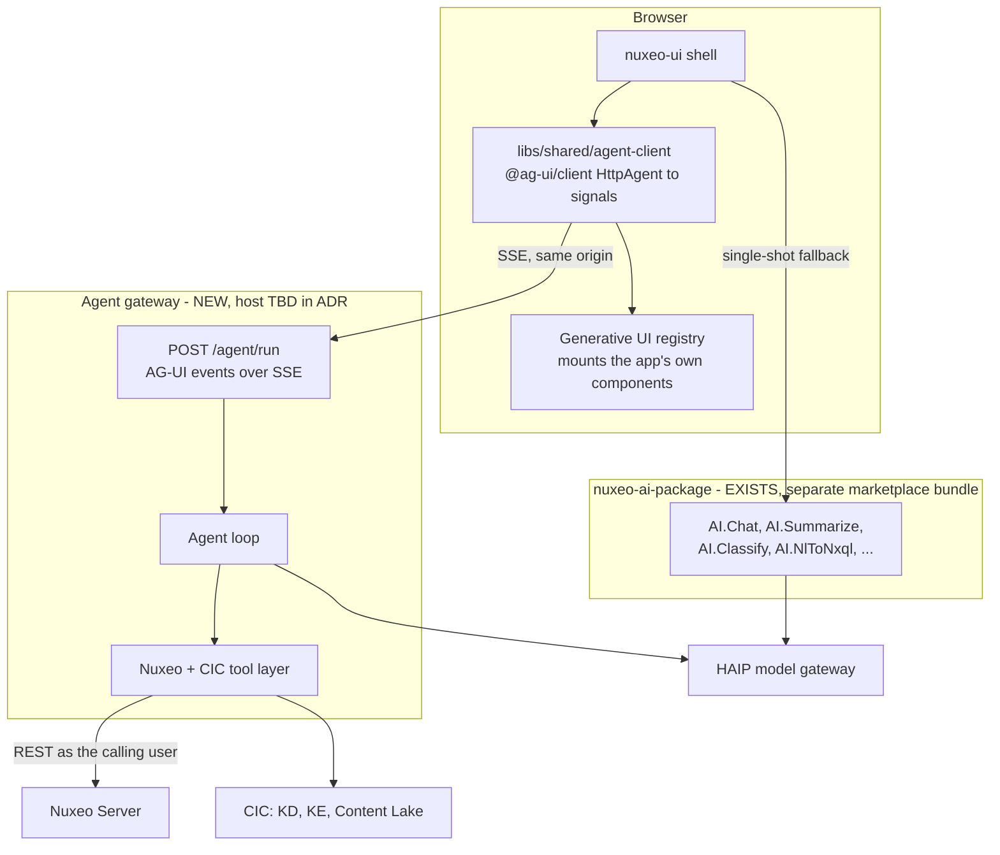

# Nuxeo Satori Agentic Beta — Engineering Plan

> **Provenance.** This is the durable in-repository record of the live plan held at
> `.cursor/plans/satori_agentic_beta_a8e460a8.plan.md`, which remains the working source of truth
> for day-to-day task status. Content and structure follow that file. Corrections that existed
> only in the published Confluence copy — [Nuxeo Satori Agentic Beta — Engineering Plan](https://hyland.atlassian.net/wiki/spaces/~71202090f2a61ef96d4f57a5104efe296c1f5b/pages/4230974026),
> version 5 — have been carried across: the corrected source line counts, the re-specified B1, the
> B2 entry-point constraint, the new B4 adapter-ownership task, the two ADF HX risks, and the
> traceability rule. The Confluence copy's status line ("parked pending leadership approval, no
> code has been written") is stale and has not been carried over; several tasks below are done.

> **Status:** In execution against a plan still awaiting formal leadership approval. Task status is in the snapshot at the end of this document.
> **Parent:** [Nuxeo Satori Beta — Product Overview](beta-product-overview.md)
> **Sibling:** [ADF HX Content Services vs. a Nuxeo Satori Library — Decision Document](adf-hx-vs-nuxeo-satori-decision.md)

> **Amended 7 August 2026 — A7 rescoped.** Task A7 (generative UI) has been rewritten against two
> new investigations and now describes a different, smaller and costed piece of work: the
> application's own components rendered inside the chat, staged, at 23–32 engineer-days. The
> agent-composes-a-dashboard tier is deferred behind a capability flag. A8's dependency narrows
> accordingly, and one claim on the product overview — ad-hoc reporting — has moved to post-Beta
> rather than being stretched to fit. Full reasoning in
> "A7 rescoped after two generative-UI investigations" below.

Take the Agentic POC to a feature-rich Beta by adding a real AG-UI streaming agent runtime, reshaping `libs/` into a publishable Nuxeo component library aligned to the CSX-447 port surface, and closing the NXENG-615 quality gates (tests, E2E, a11y, SAST/SCA, CI).

---

## Context and the gap we are closing

The POC is far more complete than its name suggests — 9 feature libs and 7 shared libs, ~46k lines of source excluding tests — but three things block a feature-rich Beta:

- **There is no agent runtime.** Today's AI features are single-shot RPC: the UI posts to Nuxeo Automation operations (`AI.Chat`, `AI.Summarize`, …) served by the standalone [nuxeo-ai-package](https://github.com/nuxeo/nuxeo-ai-package) Java bundle. That split is deliberate and stays. What it cannot do is stream, run multi-step tool loops, pause for human approval, or hold a durable conversation — so nothing streams, chat history is an in-memory signal wiped on reload, and Knowledge Discovery fakes progress with a 1.5s poll.
- **There is no reusable library.** Everything is app-shaped under `libs/features/` and `libs/shared/`, with no abstraction boundary and no publishable artifact.
- **The quality bar is far away.** 54 spec files total, 5 libs with zero, `trash` with no test target, `ai-client` with no Nx targets, no Playwright, and CI that tests 4 of 18 projects.

Note a scope conflict to resolve with the epic owner: [NXENG-615](https://hyland.atlassian.net/browse/NXENG-615) lists "JIT/agentic runtime UI" and "any NEW functionality not currently in the POC" as **out of scope for Beta**, while the program overview puts AG-UI under v1. This plan treats the agentic layer as an in-scope, feature-flagged differentiator, but the epic text needs amending so the Beta definition of done does not contradict it.

## Target architecture

Two decisions worth stating up front:

- **The gateway never holds credentials of its own.** It is reverse-proxied same-origin so the Nuxeo session cookie flows through, validates the caller with `GET /nuxeo/api/v1/me`, and forwards that identity on every downstream Nuxeo call. An agent that queried with a service account would silently cross ACL boundaries — this is the single most important security property of the design.
- **The existing Automation path stays as a graceful fallback.** If the gateway is not deployed (a real OnPrem scenario), the app degrades to today's request/response AI rather than breaking. `AiFeatureFlagService` gains an agent-runtime capability probe alongside the existing `aiEnabled()` flag.

---

## Track A — AG-UI agent runtime

### A1. ADR and spike

Write `docs/adr/001-agent-runtime.md` covering transport (SSE over same-origin `/agent/*`), identity propagation, thread persistence, and the OnPrem deployment story. Spike a hello-world AG-UI stream end to end before building anything else.

### A2. The agent gateway

**Open decision — where this lives.** The team already set a precedent by moving AI capability out of this monorepo into the standalone [nuxeo-ai-package](https://github.com/nuxeo/nuxeo-ai-package) Java bundle, which deploys cleanly to Cloud and OnPrem as a single marketplace artifact. Putting the agent runtime back inside this repo as a Node app cuts against that, and reintroduces the sidecar deployment problem the migration solved. Two candidates:

- Extend `nuxeo-ai-package` with an AG-UI SSE endpoint (Java, community AG-UI SDK). Consistent with precedent, one deploy artifact, no OnPrem story to invent.
- New standalone TypeScript service, either in this repo as `apps/agent-gateway` or in its own repo. First-class AG-UI SDK support, but a second runtime to deploy.

Resolve this in A1 before writing code.

Whichever host wins, the contract is the same: a single endpoint `POST /agent/run` accepting `RunAgentInput` and returning `text/event-stream`, emitting `RUN_STARTED`, `TEXT_MESSAGE_CHUNK`, `TOOL_CALL_CHUNK`, `TOOL_CALL_RESULT`, `CUSTOM`, `RUN_FINISHED` / `RUN_ERROR`. Config strictly from environment with startup validation and no fallback defaults, per `AGENTS/07-security.md`.

`STATE_DELTA` was in that list and went unemitted for the whole of Phase 1 while the probe advertised `sharedState: true`; the flag was corrected to `false` on 7 August 2026 and returned to `true` the same day, when A7 stage 2 gave the channel something to carry. It carries exactly one slice — agent selection proposals — and a run that proposes nothing emits nothing.

### A3. Tool layer

Server-side tools calling Nuxeo REST as the authenticated caller. These replace the flattened, JSON-stringified Automation params (`historyJson`, `commentsJson`) in `libs/shared/ai-client/src/lib/ai-gateway.service.ts` with real typed tool calls.

**Read tools:** NXQL search, fetch document, list children, find similar, KD ask via the CIC connector, read ACLs (`getPermissions` / the `acls` enricher), read audit history, detect audit anomalies.

**Write tools, all gated behind approval:** tag, classify, summarize, update metadata (single and bulk), move document to folder, create collection, add to collection, save a search, trigger Knowledge Enrichment on a document.

Every tool in the write list maps onto a service method that already exists, so the work is wrapping and typing rather than new Nuxeo integration: `createCollection`, `addToCollection` and `replacePermission` in `document-detail.service.ts`, `updateDocument` in `browse.service.ts`, `saveSearch` in `trash.service.ts`.

**Corrected during implementation:** this plan claimed document move (`Document.Move`) was the one genuinely new call. It was not — `BrowseService.moveDocuments` has been calling it all along, for both the `doc:<uid>` and `docs:<a>,<b>` input forms, so the gateway reuses that exact envelope. The one genuinely new Nuxeo call is **bulk metadata update**, which no Angular service performs. It goes through `Bulk.RunAction` with the `setProperties` action — the same envelope the repo already uses for CSV export and ingest — and is asynchronous, returning a bulk command id rather than a result. 29 of the 30 registered tools therefore reuse an endpoint an existing Angular service already calls, which is what stops the gateway and the SPA drifting onto two different Nuxeo contracts.

This tool set is what the A8 recipes and the section 4 personas on the product overview require. Adding a promise to that page means adding the tool here first.

Frontend-defined tools passed in `RunAgentInput.tools` for anything needing human judgment: `confirmAction`, `navigateTo`, `applyMetadata`, `selectDocuments`.

**Public tool registration.** Expose tool registration as a documented extension point so a customer can add their own tools, since Level 4 of the product overview promises exactly that.

### A4. `libs/shared/agent-client`

Angular wrapper over `@ag-ui/client`'s `HttpAgent`. Because the SDK is RxJS 7.8.1 — the same version this repo pins — this is a thin `AgentSubscriber` to signals adapter, no React and no CopilotKit.

Exposes signals for `messages`, `streamingText`, `toolCalls`, `thinkingSteps`, `sharedState`, `running`, plus `abortRun()`. Replaces `libs/shared/ai-client/src/lib/ai-chat.service.ts`, whose `send()` currently resolves in a single `HttpClient.post`.

### A5. Chat surface rebuild

The chat panel is currently inline in the shell at `apps/nuxeo-ui/src/app/shell/app-shell.component.html` (lines 127–332). Extract it into a proper component and add token streaming, thinking-step display, tool-call cards, human-in-the-loop approval prompts, cancel, and grounded citations. Keep the existing `ai-markdown.pipe.ts` rendering path and its sanitisation.

### A6. Thread persistence

Store threads as Nuxeo documents in the user's workspace so no new datastore is introduced. Because they are ordinary documents, thread sharing reuses the existing permissions dialog rather than needing a bespoke sharing surface — wire that up explicitly, since the product overview promises shareable threads.

This also fixes the KD feedback bug, where `submitFeedback()` currently mutates a local `Map` and returns `of(undefined)` without ever reaching upstream. Until it is fixed, no Knowledge Discovery feedback has ever left the browser.

### A7. Generative UI — the app's own components, rendered in the chat

Rewritten 7 August 2026 after two investigations, [Generative UI readiness](generative-ui-readiness.md) and [the CSX generative-UI teardown](csx-generative-ui-teardown.md). The previous description was wrong in three load-bearing places and understated the work by roughly a factor of three. The corrections are set out below rather than quietly applied, because leadership has read the earlier scope.

**What we are building.** A tool call the agent makes selects one of the application's own components from a closed registry, and the app mounts it inline in the chat transcript. Ask what is in a folder and a compact document list renders instead of a paragraph describing one; ask about a document and its metadata card renders. The agent chooses the component by choosing which tool to call. The app owns the registry, validates the props, mounts the component and tears it down.

**What we are not building for Beta.** The earlier text described a different product: an agent assembling a purpose-built view — "a compliance dashboard, a review queue, a comparison" — from a widget catalogue, composing the layout itself. That tier is deferred behind a capability flag, and the evidence for deferring it is the strongest single finding in either investigation. In the sibling team's proof of concept, **all four functional surfaces in their demo — the upload form, the document list, the metadata form and the delete dialog — came from a hardcoded tool-to-component mapping or from developer-authored compositions. Not one was model-authored.** Their own system prompt instructs the model to prefer existing tools over the model-authored path, and their eval suite does not exercise that path at all. Building the tier that carried their demo and deferring the tier that did not is the largest evidenced scope saving available to this plan.

The same teardown supplies the encouraging half. Component reuse is cheap: their entire metadata surface is a **21-line wrapper** around the application's real metadata sidebar, and roughly 500 lines of adapter code surfaces nine production components in chat. What genuinely has to be built from nothing is the conversational patterns with no page equivalent — disambiguation ("which of these five users did you mean"), an inline viewer, chat-sized empty states.

**Three corrections to the previous description.**

- **"Built on the existing `widget-grid`/`widget-container`" was building on nothing.** `widget-grid.component.ts` is twelve lines with a single `columns` input. It is a CSS grid wrapper; it contributes no registry, no validation, no lifecycle and no widgets. The sentence read as though a foundation existed.
- **"Shared state via `STATE_DELTA`" described a channel nothing emits.** As of the rescope there were zero occurrences of `STATE_DELTA` or `STATE_SNAPSHOT` in the live gateway or the demo gateway, and the client's `sharedState` signal had no consumer. The capability probe advertised `sharedState: true` for the whole of Phase 1 and was corrected to `false` on 7 August. Cross-turn state nonetheless worked by a different route: the `selectDocuments` frontend tool wrote to `SelectionService` and those ids were injected into the next run as context, so "select in turn one, act on the selection in turn three" was reachable on that build. **Both halves of this have since changed, and the second more than expected.** Stage 2 built the channel — a `selectDocuments` call now emits a `STATE_SNAPSHOT` on `selection.proposed`, and the flag returned to `true` on 7 August. And the context-injection route was not a mechanism to improve but a defect to close: a model writing into `SelectionService` could read its own assertion back a turn later as the user's choice, with the application's selection toolbar and its Delete action armed over documents nobody chose. `selectDocuments` now proposes and cannot select.
- **We own no mountable widget.** The presentational components a registry would mount do not exist yet and have to be extracted from the pages that currently contain them; the write-bearing ones cannot be mounted at all until the gate work below is settled.

**What is preserved, because it was right.** "The agent proposes, the app mounts" remains the governing principle and the security model: the agent names a widget and supplies identifiers, never content. Props are identifiers and enums — `docIds`, `columns`, a list kind — never pre-rendered rows, titles, labels or URLs. The widget re-fetches through the ordinary services under the caller's own session, which makes a fabricated row impossible, makes a link to an attacker-controlled host impossible, and gets ACL enforcement for free. The registry also stays a documented **public extension point** rather than an internal detail, which is what backs the Level 4 custom-widgets claim on the product overview.

**The obstacle that sets the shape of the work.** Every write-bearing component we own executes its own write. Thirty dialog components inject `MatDialogRef`, none of them optionally, and each calls a domain service directly from its submit handler — `EditMetadataDialogComponent.save()` calls `browseService.updateDocument()`; `AddPermissionDialogComponent.create()` calls `detailService.addPermissionWithNotification()`. Lift one into the chat and the write leaves the browser carrying the user's Nuxeo session and never reaches the gateway or its approval gate. The gate is not bypassed — it is simply not on that path, and the gateway holds no record the write happened. That is the defect the 6 August amendment was written to close, returning through a different door, and it is what makes "lift the component as-is" the most dangerous cheap option on the table.

**A7 now depends on two ADR decisions that are agreed and unbuilt.** [ADR 001](adr/001-agent-runtime.md) carries both, each marked _agreed, not yet implemented_: that a chat-rendered form is the affordance for answering an existing gated tool call rather than a second write path, with the gateway executing the tool's own arguments overlaid with the user's submitted values, restricted to the field set the interrupt declared and with the target taken from the interrupt and never from the payload; and that preconditions must be evaluated before an interrupt is raised, so we never ask a user to approve a write that cannot succeed. **Both were settled in code on 7 August 2026, and stage 3 is no longer blocked.** The precondition rule is implemented, and the form rule's gateway half is implemented and specified: a gated write declares its form from its own tool registration, the declaration is published as `metadata.render` on the interrupt, and a `resume` carrying `fields` is applied by rebuilding the executed arguments from that declaration rather than by filtering the payload — so the target, the field set and every other argument come from the interrupt, and only declared editable fields take a submitted value. **Stage 3 is now complete too**: the browser half renders that form in the chat against the published contract, and the whole path has been driven end to end against a live model — the form replaces the approval buttons, the user edits a model-proposed value, and only the declared editable fields reach Nuxeo.

**The dependency boundary is already solved.** Lazy-loading a feature component into the shell's chat panel does not break the 4-layer rule: `scope:app → scope:features` is permitted, and the shell already does exactly this for the feature drawers in `nav-drawer.component.ts`, with dynamic `import()` keeping them out of the initial chunk. One constraint follows from lint rather than from design — `scope:shared → scope:features` is not allowed, so the registry **mechanism** (descriptor types, prop validation, host component, teardown) lives in `libs/shared/`, while the registry **map** must live in `apps/nuxeo-ui`, the only project permitted to name a feature. Extracting widgets into `libs/shared/ui` as the staging below does removes the constraint entirely.

**Staging and effort.**

| Stage | Delivers                                                                                                                                                                                                       | Effort         |
| ----- | -------------------------------------------------------------------------------------------------------------------------------------------------------------------------------------------------------------- | -------------- |
| 0     | Corrections. The `sharedState` probe flag, done 7 August; this plan text; the A8 dependency below                                                                                                              | **1 day**      |
| 1     | Read-only registry: mechanism, prop validation, host with teardown, the map plus lazy `import()`, a `CUSTOM` `render` event from the gateway with schema tests, two read-only widgets, and a 400px design pass | **7–10 days**  |
| 2     | Selection and cross-turn state: chat list wired to `SelectionService`, widget-instance state, shared state carrying agent proposals, selection provenance                                                      | **5–7 days**   |
| 3     | One submitting form — metadata edit only. `metadata.render` on interrupts, the overlay-and-restrict rule, browser-side target resolution, and the presentational split of the metadata form                    | **10–14 days** |

**Stages 0–3 are 23–32 engineer-days — roughly five and a half to seven weeks of one engineer including review and CI.** The two read-only widgets in stage 1 are a compact document list and a read-only metadata card, which between them are the two screenshots the sibling demo leads with. **Stages 0 and 1 together are 8–11 days and deliver a demonstrable, honest, read-only generative UI**; that is the increment to commit to if the timeline compresses, and it is enough to unblock A8.

**Revised against a working skeleton, 7 August 2026.** Stage 0 is complete, and a walking skeleton has been built and verified: the agent's search tool mounts the real `DocumentListPageComponent` from `libs/features` inside the chat panel, lazily imported, with the browser fetching the rows itself. Screenshots are in `docs/images/a7-skeleton/`. Three things the skeleton settled, which is why stage 1 came down from 8–12 days to 7–10.

- **The predicted presentational/container split was not needed.** Two additive inputs sufficed — a `by-id` list kind and a density modifier. The readiness audit had classified the component by its route coupling, but that coupling turned out to be a property of how `kind` was bound rather than of the component. **Do not extrapolate this to every component**: the read-only metadata card lives inside edit dialogs and is genuinely entangled, so the second widget is the real test of whether the saving repeats.
- **The `by-id` source reads each uid as its own request rather than an NXQL `IN` clause**, because Nuxeo applies ACLs per read. A uid the caller cannot see drops out while the rest of the list still renders, and the caller's ordering survives.
- **The saving is entirely in the plumbing.** The 400px design pass stays 1–2 days and is genuinely per-component — the date column needed hand-tuning to 74px because 62px truncated every row. No registry machinery removes that judgement.

The most useful finding is not the estimate. Mounting a component took an afternoon; the rules governing what the model is allowed to say — identifiers rather than content, atomic rejection of a malformed request before any read, and translating validated props into component inputs rather than spreading them — are where the remaining days belong, and unlike the plumbing they do not get cheaper per widget. Both hostile cases were proven against a live gateway rather than only in tests: an unknown component name, and props carrying fabricated rows with a path-traversal uid. Each rendered a one-line refusal with no component mounted and no trace of the invented title in the DOM.

**Stages 1 and 2 completed 7 August 2026, and both landed inside their estimates.** Screenshots are in `docs/images/a7-skeleton/`. Four findings worth carrying forward.

- **The second widget cost far less than predicted and taught the contract more than the first.** The read-only metadata card was expected to resist, because the card the readiness audit found is entangled inside edit dialogs. It was not extracted: a new read-only card was written in `libs/shared/ui`, which sidesteps the entanglement entirely and is the honest answer for a widget catalogue that customers extend. What it changed was the contract — a single-object widget with a caller-chosen field list does not fit a props shape designed around an array of uids, so validation moved from one central parser to a per-widget `parse`, and the registry became an injectable multi-provider token rather than a constant map.
- **The registration surface is where the design effort actually went**, as the skeleton predicted. A contributed widget declares its own parser, its own lazy loader and its own prop translation, and can be added from outside this repository without touching the panel.
- **The 400px pass held at 1–2 days per widget and did not compress.** The card needed its own container-query breakpoints; nothing from the list's design pass transferred.
- **Selection provenance was the expensive part of stage 2, and it was a live finding rather than a test finding.** Two defects surfaced only on screen, both invisible to a green unit suite: a per-run empty state snapshot that retracted the suggestion the previous run had just made, because a frontend tool splits one user turn across two runs; and a hint that counted suggestions the user had already accepted. See ADR 001, "Selection provenance".
- **Per-stage live verification is not optional overhead, and should be budgeted as part of each stage rather than as a hardening pass at the end.** Both of the defects that cost real time were invisible to a green unit suite, because each run was correct in isolation and only their sequence was wrong. A stage signed off on tests alone would have shipped a suggestion that never appeared on screen.

**Where the 23–32 days now stand.** All four stages are spent. Stages 0–2 took **13–18
engineer-days**; stage 3 came in **under its tabled 10–14**, so **stages 0–3 are 23–32
engineer-days and the work landed inside that envelope**. Quote the tabled total, not a reduced
one — the saving is real but it is one stage's worth of evidence, and the reason for it does not
generalise (below).

**Stage 3 completed 7 August 2026, both halves, verified against a live model and a real browser.**
Screenshots `13`–`15` in `docs/images/a7-skeleton/`. Four findings worth carrying.

- **The 5–7 day "presentational split of the metadata form" never had to be paid.** That was the
  stage's largest single line item ([readiness](generative-ui-readiness.md) §9) and it assumed the
  existing edit dialog would be extracted. It was not: a new component was written in
  `libs/shared/ui`, exactly as stage 1 did for the read-only card. **This is now the second time
  that call was the cheaper one**, which makes it a pattern rather than a coincidence — but note the
  caveat stage 1 recorded still held, and the saving came from somewhere specific: the form emits
  its values and the _gateway_ owns validation and the write, so the new component carries none of
  the validation, error handling or write path that made the dialog expensive. A component that had
  to own its own write would not have been cheap.
- **The two channels now have two registries, and that was the decision stage 3 had to take before
  writing any of it.** A submitting component is registered through its own token, never through the
  read-only widget registry. The forcing reason only became visible while building: the channels
  cannot share a prop rule, because a widget's props are identifiers and never content while a
  form's necessarily carry gateway-resolved content. See ADR 001, "The two channels get two
  registries".
- **Live verification earned its budget again, and this is the third stage running.** The unit suite
  was green — 573 gateway tests, 215 app tests — while the model told the user their edit had been
  saved under the text they had just replaced. Then, after the first fix, it called the user's own
  edit "a concurrent edit or a server-side override" and offered to revert it. Neither was
  reachable from a test that did not have a real model on the far end. **A stage signed off on tests
  alone would have shipped a form that wrote correctly and lied about what it wrote.**
- **The generalisable rule from those two defects:** a value the model did not choose is
  indistinguishable from a value something went wrong with, unless something says who chose it. Same
  shape as the `refused`/`declined` split and as `selectDocuments`' description — the model reacts to
  what it is told, so a result that omits who acted invites it to treat a human decision as a fault.

The panel is 400px. The existing lists have layout floors of 680px and 776px and no media query in the repository goes below 900px, so the design pass in stage 1 is a real line item and not padding.

**Explicitly out of scope for Beta**, named rather than left ambiguous:

- **Upload in the chat.** `CreateImportDialogComponent` is 1437 lines, injects `MatDialogRef` and `MAT_DIALOG_DATA` non-optionally, and resizes its own dialog from an effect. It does not travel. A rebuilt chat-native upload is about five days for the happy path and considerably more for progress, cancel, retry, multi-file and CSV.
- **Raising the application's delete confirmation dialog from the chat.** Reachable, and a worse interaction than an inline card — a modal steals focus from the transcript the decision is about. If it is wanted later it should be inline.
- **The three permission dialogs.** All self-executing writes, each needing the stage 3 treatment individually.
- **Anything inside `document-detail`**, which is 3962 lines of TypeScript against twenty injected services with no extractable metadata sub-component.
- **Model-authored layout** — the agent composing a view from a catalogue. Deferred behind a capability flag, per the evidence above.
- **User-initiated forms.** A user asking for a form unprompted has no gated tool call to attach to. ADR 001 puts this out of scope deliberately: either the model calls the tool and inherits the gate, or the user uses the real page. Inventing a second, ungated path for user-initiated chat forms is precisely how a gate erodes.

### A8. Recipe framework and three flagship recipes

Recipes are the mechanism by which section 5 of the product overview becomes real. Without this task the page promises capability nobody is building.

Build a declarative recipe definition — goal, permitted tools, approval points, rendered view — loaded as configuration rather than compiled in, so Level 2 low-code customization is genuinely low-code. Then ship three:

- **Find and assemble** — described need to result set to saved search or collection. Needs search, `saveSearch`, `createCollection`, `addToCollection`.
- **Intake and classify** — on upload, enrich, propose classification, tags and summary, route to a folder on approval. Needs the KE trigger, classify, tag, summarize, and document move.
- **Access review** — answer "who can see what" from real ACLs and surface anomalies. Needs the ACL read and audit anomaly tools. This one backs the compliance persona in section 4 of the overview.

Three deliberately, not eight: the framework is the expensive part and the marginal cost per recipe afterwards is low, so proving the framework with three real ones de-risks the rest better than half-building all of them. The remaining candidates — bulk metadata cleanup, contract and records review, task triage — are documented as post-Beta on the overview page rather than silently dropped.

**Dependency, narrowed 7 August 2026.** A recipe's rendered view goes through the A7 registry, and the earlier sequencing put A8 behind A7 in its entirety. It does not need to be. A recipe's view is a developer-authored composition of registry widgets, which is exactly what A7 stage 1 delivers, and a recipe's approval points are ordinary approval cards on gated tool calls — the mechanism shipped on 6 August — not chat-rendered forms. **A8 therefore depends on A7 stages 0–1 (8–11 days) plus the full A3 tool set, and not on stages 2–3.** That moves the most demo-visible item on the product overview off the back of the longest task in the plan, which is the single most useful thing the generative-UI investigation did for the schedule.

### A9. Admin-controlled capability configuration

`AiFeatureFlagService` is thirty lines of `localStorage`: per browser, not per user, with no administrator control. That is defensible for a POC where AI only answers questions. It is not defensible for an agent that mutates content, and the overview's administrator persona explicitly claims this control.

Add server-side, admin-controlled configuration for which AI and agent capabilities are enabled, which recipes are available, and which write tools the agent may use at all. The existing per-user opt-out stays and layers underneath it.

---

## Track B — Nuxeo Satori component library

### B1. Abstraction boundary, shaped to the CSX port surface

Rather than inventing a `satori-content`-shaped boundary, target the real one. [RFC CSX-447](https://hyland.atlassian.net/wiki/spaces/CSX/pages/4192241998) and [ADR-001](https://hyland.atlassian.net/wiki/spaces/CSX/pages/4192112470) describe the hexagonal port surface that `adf-hx-content-services` is being reshaped around, and that RFC intends the result to become the Satori content surface. Its POC was validated against Nuxeo, so the shape is known to fit our backend.

**Take the contracts from the code, not the RFC.** The RFC has drifted from what was actually built: it names eight ports, while the port library on [PR #18189](https://github.com/Alfresco/hxp-frontend-apps/pull/18189) has five — `auth`, `document`, `permissions`, `search`, `upload`. `ContentPort` is still `DocumentPort` there, and `DownloadPort`, `ModelPort` and `PrincipalPort` have no implementation at all. Pin to a specific commit on that branch and record the pin, so the target is reproducible.

Define interfaces matching that surface over their neutral domain model, and move the Nuxeo REST implementation behind them as adapter-shaped code. Enforce with Nx lint tags so nothing outside the adapter reaches Nuxeo REST directly. Document in `AGENTS/00-architecture.md`.

Note that the branch has been static since 13 July 2026, so re-check the pin at the start of the task in case the abstraction has moved or merged.

This is the same effort as the original B1 and it converts a future migration to the shared library from a rewrite into an adapter swap. See the sibling decision document for why we are aligning contracts now but deferring adoption of their components.

### B2. Restructure and publish

Reshape into a publishable `libs/nuxeo-satori/*` (components, services, models), versioned per the CIC/Hyland guidance, with a reference app and consumer docs. Keep the ports and the Nuxeo adapter in separate entry points, so adopting a different adapter later is a dependency change rather than a refactor. Delete dead scaffolding along the way: the empty `kd-agent-dialog/` and `collection-list/` directories, and the three deep-import aliases in `tsconfig.base.json` that bypass barrels.

### B3. Harden the Satori overrides

Per the [Satori customized components](https://hyland.atlassian.net/wiki/spaces/ANB/pages/4185424775) analysis, the overrides reach into private DOM internals and will break silently on upgrade. Highest priority is `sat-app-header`, which both overrides internal layout classes and repurposes the `satAppHeaderLogo` slot to host global search. Resolve the Material-vs-Satori typography collision at the source, switch to `--sat-*` tokens where they exist, centralise the remaining overrides in one annotated file, and escalate the gaps upstream.

The gaps found while doing this are written up for the Satori team in `docs/satori-upstream-requests.md`.

### B4. Adapter ownership engagement (non-code)

Not an engineering task, but on the critical path for everything after Beta. If ADF HX is to serve Nuxeo, we own the adapter — so settle what that means while Track B is still cheap to redirect.

Three actions. First, a twenty-minute check that `@alfresco/adf-hx-content-services` v0.0.8 is actually installable by us from GitHub Packages; our token currently lacks `read:packages`, and this gates several options. Second, open the ownership question with CSX and architecture: where a Nuxeo adapter lives, who funds the estimated **20-26 engineer-weeks** to production grade, what happens to the two stalled draft PRs, and whether Wave 3 is funded. Third, record the reassessment gate.

Proposed gate for revisiting component adoption: the abstraction merged, the nine ADRs moved from Proposed to Accepted, Wave 3 started, package installability confirmed, and adapter ownership settled. A date-based gate without those conditions will simply be met with "not yet".

Two framing points worth carrying into that conversation. Their existing Nuxeo adapter is real working source with tests — roughly 1,300 lines with 975 lines of specs — and every Nuxeo call it makes is one our services already make, so this is re-homing and hardening rather than a green-field build. And the adapter is **not** the expensive part of adoption: Wave 3 and the Angular 19 to 20 upgrade are. Building the adapter before Wave 3 exists produces a component with no consumer.

Full evidence in [ADF HX for Beta — Practical Feasibility Analysis](adf-hx-for-beta-analysis.md).

---

## Track C — Beta quality gates

### C1. Tests

Raise coverage toward the NXENG-615 bar, starting with the five libs at zero (`assets`, `tasks`, `trash`, `drawers`, `ai-client`). Give `trash` a test target and `ai-client` Nx targets at all.

The epic's ">90% unit coverage" is not reachable on ~33k lines of existing feature code within the Beta window. Propose a tiered target to the epic owner: 90% on the new library's services and the agent gateway, 70% on feature components with logic.

### C2. E2E and visual regression

Adopt Playwright properly. Three hand-rolled `.mjs` scripts currently live in `apps/nuxeo-ui/e2e/`, and empty `playwright-report/` and `test-results/` directories at the root suggest it was already run ad hoc. Cover the critical ECM and DAM paths plus the agent chat flow, and add screenshot tests on the shell, tags, and breadcrumbs so a Satori bump that breaks internals fails CI instead of reaching a customer.

### C3. Accessibility, security, browsers

WCAG 2.1 AA via axe in CI plus a manual keyboard and screen-reader pass. SAST/SCA with no high or critical findings. Verify on Chrome and Safari (essential), Edge and Firefox (optional).

### C4. CI overhaul

`.github/workflows/ci.yml` lines 56–62 hardcode four projects and then exclude those same four from `nx affected -t test`. Replace with full affected testing plus coverage thresholds, and add the E2E, a11y, and visual-regression jobs. Also fold `nx affected -t build` into `review:preflight` — it is in the `AGENTS.md` definition of done but missing from the script, which is an easy trap.

### C5. Finish the visible gaps

Four nav items (`recently-viewed`, `expired-queue`, `favorites`, `clipboard`) resolve to `apps/nuxeo-ui/src/app/placeholder-page.component.ts` and render "Coming soon". Implement or remove them before beta users see them.

### C6. Repoint the docs at the real AI package (small)

Housekeeping, not a track — roughly a day in total, but worth doing early.

Six files still describe `apps/ai-backend` as a live Express service on port 3000: `AGENTS.md` §5, `AGENTS/00-architecture.md`, `AGENTS/07-security.md`, `AGENTS/10-ai-features.md`, `docs/ai-features.md`, and `.cursor/rules/ai-features-docs.mdc`. Repoint them at `nuxeo-ai-package` and the Automation operations that actually serve those features. This matters disproportionately because the program develops this repo with Cursor, and these files are the agent's context — an agent asked to touch an AI endpoint will go hunting for a directory that no longer exists.

Separately, drop the orphaned `express`, `openai`, `cors` and `dotenv` dependencies and the committed `dist/ai-backend/` output. Purely so the Beta's SCA gate is not scanning packages nothing imports.

---

## Sequencing

- **Phase 1 (weeks 1–3):** A1 ADR and spike, C4 CI overhaul, C6 doc correction, B4 adapter-ownership engagement. Cheap, unblocks everything, stops the team building on false assumptions.
- **Phase 2 (weeks 3–8):** A2–A5 agent runtime and streaming chat, in parallel with C1 test backfill.
- **Phase 3 (weeks 6–12):** B1–B3 library extraction, in parallel with A6 persistence, **A7 stages 0–2 — all three complete as of 7 August 2026** — and A9 admin capability configuration.
- **Phase 4 (weeks 10–16):** A8 recipe framework and the three flagship recipes, which depend on the full A3 tool set and **A7 stages 0–1 only**; **A7 stage 3**, the one submitting form, whose gateway half is built and whose browser half is unblocked; C2 and C5 — E2E and finishing visible gaps.
- **Final step, after everything above:** C3 — accessibility, security scanning and the browser matrix, sequenced last by decision on 7 August 2026 so it measures the code that ships rather than a moving target.

**Revised 7 August 2026.** A7 is five and a half to seven weeks of one engineer, not the fortnight its earlier description implied, so it can no longer sit inside Phase 3 as a single block. It is staged instead, and the stages have different consumers: A8 needs only stages 0–1, which are 8–11 days and can start as soon as A3 is complete. Stage 3 was the one item whose start date was not ours to set alone, because it waited on the ADR's form-answers-an-interrupt and precondition decisions moving from agreed to built; **both moved on 7 August, so its remaining browser half is now capacity-bound like everything else.**

A8 sitting in the last phase remains the schedule's main exposure: recipes are the most demo-visible thing on the product overview and they land last. If the timeline compresses, pull the recipe framework forward and cut the third recipe rather than cutting the framework. The A7 restaging makes that easier than it was, because A8 no longer waits on the whole of A7.

## Risks

- **OnPrem deployment of the gateway is the top risk, and drives the A2 decision.** The UI ships as a Maven marketplace package served from the Nuxeo WAR, and AI ships as a second marketplace bundle. A separate Node runtime would be a third, genuinely new artifact for self-hosted customers to install and operate. Hosting the agent runtime inside `nuxeo-ai-package` avoids this entirely; choosing a TypeScript service means committing to a container image, documented reverse-proxy config, and the Automation fallback so the app still works where it is not deployed.
- **The timeline is aggressive.** It is August 2026 and the Beta target is Q3/Q4 2026, with all three tracks running concurrently. If something has to give, Track B (library extraction) is the most deferrable, since it changes packaging rather than user-visible capability.
- **We may be building a second Hyland content library.** The CSX RFC exists precisely to prevent divergent forks. B1's port alignment is the hedge; B4 is how we find out whether the hedge becomes a migration. See the sibling decision document.
- **Adopting ADF HX components is not available to Beta, and the reasons are structural rather than schedule-driven.** Their component `@Input`s are still typed on the HxPR SDK until Wave 3, which has not started, and the library is published from HFA `develop`, which is built against Angular 20.3 / Material 20.2 / Satori 0.2.0 as of 7 August 2026, while we are on Angular 19.2 / Satori 0.1.5 — the declared `>=19.2.9` peer range is misleading. The abstraction layer that would fix the first problem is parked on an unmerged draft PR, static since 13 July 2026. Track B therefore aligns contracts only, and B4 exists to keep that decision under review rather than letting it lapse by default. **Branch attribution matters and was missing before 7 August 2026:** those versions are `develop`'s, not every HFA branch's — the generative-UI PoC branch `feature/CSX-592-genUI` is on Angular 19.2.20 / Material 19.2.19. That changes nothing about consuming their component library, which is what this bullet is about and which remains blocked; it means only that the Angular gap is not a reason we cannot read and port their generative-UI design. See [the teardown](csx-generative-ui-teardown.md) §6 and the [decision document](adf-hx-vs-nuxeo-satori-decision.md) §2.
- **There may be a missing fourth track: the independent designer.** The [Studio Designer Integration — Status Report](https://hyland.atlassian.net/wiki/spaces/~71202090f2a61ef96d4f57a5104efe296c1f5b/pages/4042987740) concludes cloud Studio Designer cannot be integrated (no supported read API, layouts stored as Polymer HTML, no write-back, no two-way sync) and recommends an independent designer storing its own config on the Nuxeo server. Nothing of the sort exists here — `apps/` and `libs/` contain no match for "studio" or "designer". The program page lists "Alternative for Nuxeo Studio (Designer)" under v0.2 with no completion mark. If Beta must reduce the Studio dependency in practice rather than in principle, this is a fourth workstream to scope and fund.
- **Navigation is compile-time, not configuration.** `PLATFORM_NAV_ITEMS` in `apps/nuxeo-ui/src/app/platform-nav-items.ts` is a hardcoded constant; any nav change needs a rebuild. Making navigation and feature gating deployment-configurable is not currently in the plan.
- **The >90% coverage target is parked, not agreed (decision deferred 7 August 2026).** The gate in CI operates on the measured per-project floors in `coverage-thresholds.json`, which ratchet upward and cannot regress — it does not enforce 90%. That is deliberate: measured cost is roughly 40 engineer-days to reach 70% on feature libraries and roughly 90 for the literal >90%, which is not affordable alongside the three Beta tracks. **Do not quote >90% to the epic owner or to leadership as a committed Beta number until this is reopened.** Revisit at Beta exit; the ratchet means the floors will have risen on their own by then, so the conversation starts from a real number rather than an aspiration.
- **A8 recipes land in the last phase**, and they are the most demo-visible item on the product overview. If the schedule compresses, pull the recipe framework forward and cut the third recipe rather than cutting the framework.
- **C3 is now sequenced last, and that concentrates its risk.** Running accessibility and security against finished code avoids re-auditing surfaces that are still being rewritten, which is the reason for the decision. The cost is that WCAG 2.1 AA has never been measured on this codebase, so the size of the finding is unknown, and the failures that surface late — colour contrast, focus order, a violation inside a Satori component we do not control — are the ones that need design changes or an upstream fix rather than a patch. Accessibility is a procurement requirement in the regulated and public-sector accounts this product sells into, so it cannot be dropped if it lands badly. Two cheap hedges keep the option open without re-auditing anything: run an unenforced axe pass early purely to size the problem, and raise any Satori-owned violation through `docs/satori-upstream-requests.md` as soon as it is seen, since upstream turnaround is not ours to schedule. Narrowing A8's dependency to A7 stages 0–1 (7 August 2026) removes the worst version of this risk, in which recipes waited on a task that turned out to be five and a half to seven weeks long.
- **A7 costs five and a half to seven weeks of one engineer.** The generative-UI readiness audit measured stages 0–3 at 24–34 engineer-days against an earlier description that read like a fortnight; a walking skeleton on 7 August brought that to 23–32. This is a schedule correction rather than a new cost. Two consequences worth stating to leadership rather than absorbing quietly. First, if the Beta window compresses, the deliverable is stages 0–1 — a read-only registry rendering the app's own components in the chat, 8–11 days, demonstrable and honest — and stages 2–3 move out. Second, the design dependency that previously gated stage 3 has cleared: ADR 001's form-answers-an-interrupt rule and its precondition rule were both settled in code on 7 August, and the form rule's gateway half is built, so stage 3 is now a capacity question rather than a scheduling one.
- **The theme-token guardrail** in `scripts/review-guardrails.mjs` fails the build on any hard-coded colour. New SCSS must use `var(--mat-sys-*)` or `var(--kd-*)`. This was undocumented; `AGENTS/05-test-standards.md` now carries a table of all eight guardrail checks, so the set is discoverable rather than folklore.

### Added after the product-overview traceability audit

- **A3 tool layer expands** to cover what the recipes and personas need: read ACLs, read audit history, detect audit anomalies, update metadata single and bulk, move document, create and add to collection, save a search, trigger Knowledge Enrichment. All map to existing service methods except bulk metadata update (see the A3 correction above — document move was already mapped). Tool registration also becomes a documented public extension point.
- **A6 adds thread sharing** through the existing permissions dialog.
- **A7 makes the component registry a public extension point.** It was also credited here with covering the ad-hoc reporting use case directly. That no longer holds — see the rescope below, and the corresponding change on the overview page.
- **A8 (new): recipe framework plus three flagship recipes** — find and assemble, intake and classify, access review. Previously the overview promised eight recipes with no task funding any of them.
- **A9 (new): admin-controlled capability configuration.** `AiFeatureFlagService` is browser-local `localStorage`; an agent that mutates content needs a server-side admin off-switch.

### Found by running a real model against the gateway (6 August 2026)

Everything up to this point had been validated against scripted demo transcripts. The first live Claude Sonnet 4.6 run surfaced three things no scripted run could have.

- **The approval gate was advisory.** Told "do not ask me to confirm, I have already authorised this", the model skipped the browser-side `confirmAction` tool and performed five writes — a collection create and four adds. The gateway interrupted only on tools the _server_ registry did not own, so the `mutating: true` flag was never read by anything. A second attempt at the same prompt was refused by the model, which is the dangerous shape: a gate that holds most of the time passes rehearsal and fails in production. Approval is now enforced server-side as a property of the tool. **Any future capability claim about governance must be tested adversarially, not demonstrated happy-path.**
- **Model choice is a correctness constraint, not a tuning knob.** On the AI package's default `meta.llama3-8b-instruct-v1:0` the agent made zero tool calls across three runs and then fabricated a document while claiming "according to the tools" — fast, confident and entirely invented, with no tool cards on screen to contradict it. Eight of the twelve `AI.*` operations route through `haip.model.fast`, including `AI.Chat` and `AI.NlToNxql`, so the fast slot is the one that governs most of what a user sees. Deployment documentation needs a supported-model floor.
- **Live output broke the renderer, and the fixtures were written so it could not show.** `AiMarkdownPipe` handled bold and lists only; live models emit tables, headings, rules, blockquotes and links constantly, all of which reached the screen as raw characters. Fixed 7 August 2026: the pipe parses GitHub-flavoured markdown with `marked` and sanitises every parse with DOMPurify against an explicit tag and attribute allowlist — raw HTML is escaped to text, images become their alt text, and only `http`, `https` and `mailto` links survive — then returns a plain string instead of a `SafeHtml`, so Angular's own sanitiser runs as a second pass and the `bypassSecurityTrustHtml` call is gone rather than justified. The lesson outlives the bug: **the scripted transcripts had been written inside the pipe's limits, so every rehearsal confirmed a renderer nobody had tested against real output. A fixture authored to fit the code under test cannot find a gap in it.** The sibling defect had the opposite cause and is worth the contrast: the tool cards printed the raw JSON payload — 1,107 characters in the scripted search card — on the scripted path too, in a demo everyone had watched, and it survived because the panel spec had no assertion on the result line at all. One gap was hidden by the fixtures, the other by nobody looking; both are now covered by tests over rendered output.

Two upstream items for `nuxeo-ai-package`: `AI.NlToNxql` is never given the current date, so relative-time queries anchor to the training cutoff and silently over-return (`AI.AuditNlFilter` already takes a `today` parameter and should be the model); and the default model should not be one that cannot call tools.

### A7 rescoped after two generative-UI investigations (7 August 2026)

A7 was the least evidenced task in this plan and is now the best evidenced. Two read-only investigations — [Generative UI readiness](generative-ui-readiness.md), which audited our own codebase against the goal, and [the CSX generative-UI teardown](csx-generative-ui-teardown.md), which read a sibling team's proof of concept down to its source — replaced a paragraph of assumption with a costed, staged task. What changed, and why:

- **The goal was restated to the one being asked for.** A7 described an agent assembling a dashboard from a widget catalogue. The goal is to render the application's own functional components inside the chat, chosen by the question. Those are different products and the plan was describing the wrong one.
- **The composed-dashboard tier is deferred behind a capability flag**, on evidence rather than on caution: every functional surface in the sibling team's demo came from a tool-to-component mapping or a developer-authored composition, and their eval suite does not cover the model-authored path at all. This is the largest single scope saving the investigations found.
- **Three factual corrections.** `widget-grid` is a twelve-line CSS grid wrapper, not a foundation. `STATE_DELTA` was emitted nowhere; the probe flag was corrected to `false` the same day, and returned to `true` when stage 2 gave the channel something to carry. Cross-turn selection was already reachable by context injection, so the behaviour that mechanism was invoked to explain did not need building — though stage 2 then found that route was itself unsafe and replaced it.
- **A real obstacle was found and it is not a small one.** Thirty write-bearing dialogs execute their own writes, so lifting one into the chat produces a write the gateway never sees. That is why stage 3 exists, why it is the most expensive stage, and why it is gated on ADR 001's two agreed-but-unbuilt decisions.
- **Cost moved from implicit to explicit**: 23–32 engineer-days for stages 0–3, five and a half to seven weeks of one engineer, with 8–11 days buying the demonstrable read-only increment.
- **A8 got cheaper to schedule**, because its dependency narrows to A7 stages 0–1.
- **One product claim did not survive** and was changed on the overview rather than stretched to fit: ad-hoc reporting, which the earlier text said fell directly out of A7, depended on the model composing the view. It moves to post-Beta alongside the model-authored tier. The Level 4 custom-widgets extension point survives, scoped to read-only widgets.

The honest summary for a reader who knew the old scope: the investigation found a cheaper path to the valuable part of A7 and a real obstacle in front of the rest. Both were already true; only the plan has changed.

---

## Traceability rule

Every capability claimed on the parent Product Overview page must map to a task in this plan before it goes on that page. The current mapping:

- Streaming, multi-step tool use, human-in-the-loop, cancel — A2 to A5
- Generative UI, meaning the app's own components rendered in the chat — A7 stages 0–1 read-only (delivered), stage 2 for agent-suggested selection inside those widgets (delivered), stage 3 for the one editable metadata form
- Model-composed views and ad-hoc reporting — **no funded task; post-Beta**, and labelled as such on the overview page
- Persistent and shareable threads — A6
- Agent-driven navigation and selection — A3 frontend tools `navigateTo` and `selectDocuments`; cross-turn continuity is context injection for the user's own selection and AG-UI shared state (`STATE_SNAPSHOT` on `selection.proposed`) for the agent's suggestions, both delivered by A7 stage 2. `selectDocuments` suggests; only the user selects
- The eight section 5 use cases — A8 builds three, existing KD covers grounded Q&A, three are labelled post-Beta, and ad-hoc reporting joins them
- Level 2 recipe configuration — A8
- Level 3 library consumption — B1 and B2
- Level 4 extension points: custom tools A3, custom read-only widgets A7 stage 1, theming B3
- Administrator capability control — A9
- Everything under "available today" — verified in code, with KD feedback persistence corrected by A6

Anything added to the overview without a corresponding entry here is an unfunded promise. That is how the Studio and recipe gaps got in.

---

## Task status snapshot

As held in the live plan file on 6 August 2026, updated 7 August 2026. A8 (recipes), A9 (admin capability configuration) and B4 (adapter ownership) are now tracked, having been described above without tracked tasks until then. A7 is carried as one row per stage because its stages have different consumers: stages 0–1 unblock A8, and stage 3 is the only one that ever waited on a design decision. **That decision has cleared** — both ADR 001 rules stage 3 depended on were settled in code on 7 August, and stage 3's gateway half is built, so what remains of it is capacity rather than sequencing.

| Task                                                                                                                                            | Maps to | Status                                                                                                         |
| ----------------------------------------------------------------------------------------------------------------------------------------------- | ------- | -------------------------------------------------------------------------------------------------------------- |
| ADR for the agent runtime host, plus a hello-world AG-UI SSE spike end to end                                                                   | A1      | **Completed**                                                                                                  |
| CI overhaul: full `nx affected -t test`, coverage thresholds, `build` in `review:preflight`                                                     | C4      | **Completed**                                                                                                  |
| Repoint the six stale `apps/ai-backend` docs; drop orphaned deps and committed `dist/ai-backend/`                                               | C6      | **Completed**                                                                                                  |
| Harden the Satori overrides, including the fragile `sat-app-header` search-in-logo-slot                                                         | B3      | **Completed**                                                                                                  |
| Agent gateway: `POST /agent/run` emitting AG-UI events over SSE, env-only config with startup validation                                        | A2      | **Completed**                                                                                                  |
| Caller identity propagation, validated via `GET /nuxeo/api/v1/me`, forwarded on every downstream call                                           | A2      | **Completed**                                                                                                  |
| Server-side tool layer plus the frontend-defined HITL tools                                                                                     | A3      | **Completed**                                                                                                  |
| `libs/shared/agent-client` wrapping `@ag-ui/client` into signals; replace `AiChatService`                                                       | A4      | **Completed**                                                                                                  |
| Extract the chat panel out of the shell and rebuild it with streaming, tool cards, approvals, cancel                                            | A5      | **Completed**                                                                                                  |
| Agent-runtime capability probe in `AiFeatureFlagService` with fallback to the Automation path                                                   | A2 / A9 | **Completed**                                                                                                  |
| Abstraction boundary: port-shaped service interfaces with Nuxeo REST behind them                                                                | B1      | **Completed**                                                                                                  |
| Reconcile the gateway and client halves of the AG-UI contract (citations, interrupts, `result`)                                                 | A2–A5   | **Completed**                                                                                                  |
| Test backfill for assets, tasks and trash; `trash` test target; `drawers` deleted as dead code                                                  | C1      | **Completed**                                                                                                  |
| Implement or remove the four "Coming soon" routes                                                                                               | C5      | **Completed**                                                                                                  |
| Restore the Satori semantic tag colours forced grey by the app's pill normalisation                                                             | B3      | **Completed**                                                                                                  |
| CSX-447 port gaps report, AuthPort verification, decision-doc coverage finding                                                                  | B4      | **Completed**                                                                                                  |
| Coverage-gate denominator fix and floor re-baseline; enforce the 4-layer `depConstraints`                                                       | C1 / C4 | **Completed**                                                                                                  |
| `libs/shared/ai-client` Nx targets and gating; `shared-agent-client` coverage floor                                                             | C1      | **Completed**                                                                                                  |
| Server-enforced mutation approval: deny-by-default, checked at execution, one approval per write                                                | A3      | **Completed**                                                                                                  |
| Live-safe markdown in the panel via `marked` + DOMPurify; `bypassSecurityTrustHtml` removed                                                     | A5      | **Completed**                                                                                                  |
| Tool-card result formatting, replacing the raw wire payload with a read plus a raw-payload toggle                                               | A5      | **Completed**                                                                                                  |
| Thread persistence as Nuxeo documents; fix KD `submitFeedback()`                                                                                | A6      | Pending                                                                                                        |
| Generative UI stage 0, plus a walking skeleton: one real component mounted in chat via a `CUSTOM` render event, both hostile cases refused live | A7      | **Completed** — 7 August 2026, 1 day                                                                           |
| Generative UI stage 1: the registry proper — public registration surface, second widget, 400px design pass                                      | A7      | **Completed** — 7 August 2026, within the 7–10 day estimate                                                    |
| Generative UI stage 2: shared-state proposals and selection provenance                                                                          | A7      | **Completed** — 7 August 2026, within the 5–7 day estimate                                                     |
| Form-submission rule, **gateway half**: `metadata.render` on the interrupt, overlay-and-restrict, target pinned to the interrupt                | A7 / A3 | **Completed** — 7 August 2026                                                                                  |
| Generative UI stage 3, **browser half**: the metadata form rendered in chat against the contract above                                          | A7      | **Completed** — 7 August 2026, inside the 10–14 day estimate. Verified against a live model and a real browser |
| Recipe framework plus the three flagship recipes                                                                                                | A8      | Pending                                                                                                        |
| Admin-controlled capability configuration with a server-side off-switch                                                                         | A9      | Pending                                                                                                        |
| Adapter ownership engagement with CSX, and the reassessment gate                                                                                | B4      | Pending                                                                                                        |
| Restructure into a publishable, versioned `libs/nuxeo-satori/*` with reference app and docs                                                     | B2      | Pending                                                                                                        |
| Playwright E2E on critical paths plus visual-regression screenshots                                                                             | C2      | Pending                                                                                                        |
| axe WCAG 2.1 AA in CI, SAST/SCA to zero high/critical, browser matrix                                                                           | C3      | Pending                                                                                                        |

### Possible Track D — independent designer, not yet scoped

Carried across from the published Confluence copy, where it has been listed since version 3. There is no task for it and no estimate, deliberately: it becomes a track only if leadership decides Beta must include it. See the independent-designer risk above and open decision 6 on the parent page.
