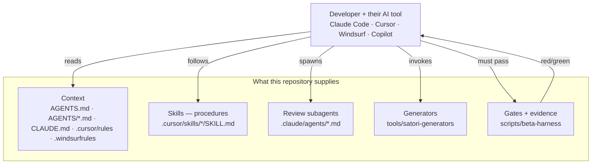

# Skills, Agents and Generators — what the AI tooling actually is

> **Last reviewed:** 2026-08-24 · **Repository:** `77265f9`
> Supersedes [`docs/agentic-system-guide.md`](../../docs/agentic-system-guide.md) and the
> agent-catalog sections of [`docs/agentic-development-system.md`](../../docs/agentic-development-system.md).

**Read this before believing the agent catalog.** The pre-existing design document describes
a four-tier catalog of **28 named agents**. Roughly a third of it is implemented. This page
gives each one a status and a citation, because a reader who takes that catalog at face value
will materially overestimate what exists.

---

## 1. There is no agent runtime in this repository

The single most common misreading. There is **no orchestrator, no agent loop, no LLM call,
no MCP server** in this codebase. `grep -rn "from 'openai'"` across `apps libs scripts tools`
returns nothing — `openai` is in `package.json` and imported nowhere (see
[Technology Stack](05-technology-stack.md) for the unused-dependency finding).

What exists is **context and constraints for whichever AI coding tool the developer is
running**, plus deterministic scripts those tools invoke. The intelligence is the
developer's tool; the repository supplies the knowledge and the gates.



The value is not in an agent framework. It is that **an agent's claim of success is
converted into an artifact that would have gone red if it were false**.

---

## 2. Deliberately multi-tool

| File                                                                       | Tool                     | Loaded                                                  |
| -------------------------------------------------------------------------- | ------------------------ | ------------------------------------------------------- |
| [`AGENTS.md`](../../AGENTS.md)                                             | tool-agnostic convention | Manually / by convention                                |
| [`AGENTS/*.md`](../../AGENTS) — 13 files, 3,083 lines                      | tool-agnostic            | Referenced by the others                                |
| [`CLAUDE.md`](../../CLAUDE.md)                                             | Claude Code              | Automatically                                           |
| [`.cursor/rules/*.mdc`](../../.cursor/rules) — 13 files                    | Cursor                   | Auto-attached by glob                                   |
| [`.windsurfrules`](../../.windsurfrules)                                   | Windsurf                 | Automatically                                           |
| [`.github/copilot-instructions.md`](../../.github/copilot-instructions.md) | GitHub Copilot           | On review                                               |
| [`scripts/agent-context.sh`](../../scripts/agent-context.sh)               | any LLM CLI              | `./scripts/agent-context.sh \| <cli> --system-prompt -` |

One knowledge base, five adapters. That is a real architectural decision: the knowledge is
not hostage to one vendor's tool.

**The knowledge base is the substance.** `AGENTS/` is 3,083 lines of accumulated, mostly
hard-won detail:

| File                        | Lines | Contains                                          |
| --------------------------- | ----: | ------------------------------------------------- |
| `00-architecture.md`        |   135 | Layer boundaries                                  |
| `01-services.md`            |   460 | The service inventory — **staleness-gated by CI** |
| `02-nuxeo-apis.md`          |   172 | Nuxeo REST/Automation patterns                    |
| `03-angular-conventions.md` |   246 | The non-negotiables                               |
| `04-feature-scaffold.md`    |   190 | How to add a feature library                      |
| `05-test-standards.md`      |   173 | What a test must assert                           |
| `06-git-workflow.md`        |   108 | Branching, conventional commits                   |
| `07-security.md`            |   123 | Credentials, sanitisation, boundaries             |
| `08-bug-patterns.md`        |   413 | Bugs already made, so they are not made again     |
| `09-pr-feedback.md`         |    71 | Responding to review                              |
| `10-ai-features.md`         |   123 | The runtime `AI.*` operations                     |
| `11-beta-program.md`        |   653 | **The phase contract, and §3 the verified facts** |
| `12-review-agents.md`       |   216 | The review-agent specification                    |

`AGENTS/11-beta-program.md` §3 is the most load-bearing: facts established first-hand,
marked _do not re-litigate_. **Two phases contradicted a verified fact without proof and both
cost real time.** Two of those facts were later found to be wrong and are now corrected
in place with the correction visible rather than overwritten — which is the right way to
treat a "settled" list.

---

## 3. Skills — 13 procedures

[`.cursor/skills/`](../../.cursor/skills). A skill is a Markdown procedure a tool reads
before starting a class of task. They are **not auto-loaded**; the entry point tells you
which to read.

| Skill                             | Use for                                                                                              |
| --------------------------------- | ---------------------------------------------------------------------------------------------------- |
| `beta-phase/SKILL.md`             | Running a Beta phase end to end. **The orchestrator.** 10 phases, human go-ahead gate after planning |
| `verify-gate/SKILL.md`            | Getting to green without churning                                                                    |
| `capture-phase-evidence/SKILL.md` | Producing evidence that proves something                                                             |
| `audit-evidence/SKILL.md`         | Auditing evidence adversarially                                                                      |
| `implement-api-port/SKILL.md`     | One of the twelve adf-hx API ports                                                                   |
| `adopt-adf-hx-component/SKILL.md` | Swapping a hand-written `hxp-*` for the real component                                               |
| `add-extension-point/SKILL.md`    | Making something manifest-addressable                                                                |
| `fix-bug/SKILL.md`                | Bug workflow                                                                                         |
| `kd-local-setup/SKILL.md`         | Knowledge Discovery local setup                                                                      |
| `add-nuxeo-api.md`                | Adding a Nuxeo API call                                                                              |
| `generate-tests.md`               | Test generation                                                                                      |
| `new-feature.md`                  | New feature workflow                                                                                 |
| `fix-pr-comments.md`              | PR feedback                                                                                          |

### The `beta-phase` skill is the real lifecycle

The generic "requirement → planning → execution → validation" lifecycle in the brief maps
onto this, which is what is actually implemented:

```text
1. Intake        — identify the phase; re-read the verified facts; confirm prerequisites;
                   establish the baseline
2. Plan          — decompose into steps. A step is well-formed ONLY if you can state the
                   assertion that will prove it BEFORE writing code
                   ⟵ HUMAN GO-AHEAD GATE
3. Branch        — never commit to main
4. Implement     — smallest change per step; layer discipline; tests incl. error path
5. Gate          — npm run beta:gate; stop after three failed attempts and report
6. Evidence      — npm run beta:evidence; must exit 0
7. Review        — parallel adversarial reviewers on different model families
8. PR            — conventional commit, evidence attached
9. CI to green
10. Close        — update phase state, delivery record, workaround register, verified facts
```

Two features of it are worth copying elsewhere:

- **A step is not well-formed unless you can state its assertion before writing the code.**
  If you cannot, the step is too vague — split it.
- **Hard stops.** The skill enumerates changes an agent must escalate rather than attempt a
  fourth time: weakening a test, widening the public API, exposing an adf-hx type,
  changing `install.xml` or marketplace packaging, contradicting a verified fact, or pinning
  an adf-hx dist-tag instead of an exact version.

---

## 4. Review agents — 2 implemented

[`.claude/agents/`](../../.claude/agents). Both `model: opus`, both
`tools: Bash, Read, Grep, Glob` — **read-only by construction**. They audit; they do not fix.

| Agent                  | Purpose                                                                                                                                                          | Guard                                            |
| ---------------------- | ---------------------------------------------------------------------------------------------------------------------------------------------------------------- | ------------------------------------------------ |
| `evidence-auditor`     | Is every assertion capable of failing? Does it assert the deliverable or the app's pulse? Are screenshots and suppressions hiding gaps?                          | **MUST NOT** be run on evidence the caller wrote |
| `acceptance-validator` | Did the phase deliver what the plan said? Does the written record match the code? Registered-but-dead surface, deviations, contradictions with earlier write-ups | Runs after the evidence auditor                  |

Specified in [`AGENTS/12-review-agents.md`](../../AGENTS/12-review-agents.md), which wins if
the definitions disagree.

---

## 5. Generators — 4 implemented, and they ship to customers

[`tools/satori-generators`](../../tools/satori-generators), Nx generators compiled into the
published package.

| Generator             | Produces                                                                                                                                                                                      |
| --------------------- | --------------------------------------------------------------------------------------------------------------------------------------------------------------------------------------------- |
| `extension-library`   | A complete Layer 2 library: project config, barrel, `extensions.ts` with marker comments, a rules service, a panel component, a spec asserting registry state, tsconfigs, vite config, README |
| `extension-rule`      | A rule evaluator spliced into the existing library                                                                                                                                            |
| `extension-action`    | An action handler                                                                                                                                                                             |
| `extension-component` | A component + registration                                                                                                                                                                    |

### The splice bug, and why the post-condition assertion exists

The three "add a contribution" generators edit `extensions.ts` through marker comments. The
first implementation computed the indent from the marker line and produced `   //` — so
every registration landed **inside a comment**. All three reported success, printed the IDs
they had "registered", and **lint, typecheck and six specs all passed.**

[`src/util/splice.ts`](../../tools/satori-generators/src/util/splice.ts) now carries a
post-condition assertion: after splicing, the inserted text must be reachable as code, not
prose. And guardrail check 3 requires a spec that asserts **registry state** — the only thing
that can tell the difference.

### They were also documented before they were shipped

The customer guide told customers to run `npx nx g ./tools/satori-generators:…` — a path
inside _our_ repository — and the generators were not in the tarball at all. The first
instruction in the shipped guide could not be run by its audience. Fixed and verified by
unpacking the tarball into `node_modules` and generating a library from it; `beta:publishable`
check 6 now asserts every generator's factory and schema is present.

---

## 6. The 28-agent catalog: implemented vs. planned

[`docs/agentic-development-system.md`](../../docs/agentic-development-system.md) §4. Status
assigned by looking for an implementation, not by reading the catalog.

### Tier 1 — IDE / interactive (8 named)

These are **not** discrete agents in the repository. They are roles a developer's AI tool
plays while following a skill and reading `AGENTS/`. Documenting them as agents overstates
the architecture.

| Catalog entry             | Status              | Realised as                                                |
| ------------------------- | ------------------- | ---------------------------------------------------------- |
| Requirement Understanding | **Not a component** | `beta-phase` skill, Intake                                 |
| Planning                  | **Not a component** | `beta-phase` skill, Plan + human go-ahead                  |
| Development               | **Not a component** | `AGENTS/03`, `04`, skills                                  |
| Test & QA                 | **Not a component** | `AGENTS/05-test-standards.md`, `generate-tests.md`         |
| Bug Detection             | **Not a component** | `AGENTS/08-bug-patterns.md`, `fix-bug` skill               |
| Code Review               | **Partially real**  | `.github/copilot-instructions.md` + the 2 review subagents |
| Git                       | **Not a component** | `AGENTS/06-git-workflow.md`                                |
| PR Feedback               | **Real**            | `.github/workflows/pr-auto-fix.yml` + `AGENTS/09`          |

### Tier 2 — continuous quality, claimed as GitHub Actions (6 named)

| Catalog entry            | Status                                   | Evidence                                                                            |
| ------------------------ | ---------------------------------------- | ----------------------------------------------------------------------------------- |
| Bundle Size              | **Implemented**, not as its own workflow | `ci.yml` "Check bundle size", 6 MiB ceiling                                         |
| Dependency Vulnerability | **Implemented** differently              | [`.github/dependabot.yml`](../../.github/dependabot.yml) + `npm audit`. **No SAST** |
| API Drift                | **Implemented**, not as its own workflow | `beta:api` gate, in `ci.yml`                                                        |
| Broken Link              | **Not implemented**                      | No workflow, no script                                                              |
| Accessibility            | **Partially**                            | `phase-6-a11y.mjs` axe scans — but **not in CI**, needs a live backend              |
| Performance              | **Not implemented**                      | Bundle size only; no runtime performance measurement                                |

### Tier 3 — scheduled & maintenance (6 named)

| Catalog entry           | Status              | Evidence                                                                     |
| ----------------------- | ------------------- | ---------------------------------------------------------------------------- |
| Stale Branch            | **Implemented**     | `stale.yml`, scheduled                                                       |
| Dead Code               | **Implemented**     | `dead-code.yml`, weekly Mon 06:00 UTC                                        |
| Changelog               | **Implemented**     | `changelog.yml`                                                              |
| AGENTS.md Staleness     | **Implemented**     | `staleness-check.yml` — flags `AGENTS/01-services.md` drifting from the code |
| Release                 | **Implemented**     | `release.yml`, manual dispatch                                               |
| Refactoring Opportunity | **Not implemented** |                                                                              |

### Tier 4 — additional IDE agents (6 named)

| Catalog entry                                                                                    | Status                                                                                               |
| ------------------------------------------------------------------------------------------------ | ---------------------------------------------------------------------------------------------------- |
| Conflict Resolution, Architecture Decision, Estimation, Migration, Regression Bisect, Onboarding | **All planned. None implemented.** No workflow, script, skill or agent definition for any of the six |

### Summary

|                                                                 |                                                                                          Count |
| --------------------------------------------------------------- | ---------------------------------------------------------------------------------------------: |
| Real, discrete, verifiable components                           |                                   **8 workflows + 2 review agents + 4 generators + 13 skills** |
| Catalog entries that are context/procedure rather than an agent |                                                                                              8 |
| Catalog entries not implemented at all                          | **8** (Broken Link, Performance, Refactoring Opportunity, and all six of Tier 4, less overlap) |

The catalog is a reasonable **roadmap**. It is not a description of the system. Treat
[`docs/agentic-development-system.md`](../../docs/agentic-development-system.md) as a design
document — which is what its own title says.

---

## 7. What this buys, and what it costs

### Demonstrated

- **The gates catch real defects.** The ledger in
  [Dev Harness & Gates §2](08-dev-harness-and-gates.md#2-the-15-gates) lists nine live
  defects found by gates, several of which had passed every other check.
- **Knowledge compounds.** `AGENTS/08-bug-patterns.md` is 413 lines of bugs already made.
  The counterfactual is a team re-making them.
- **Generators produce verified output.** After the splice fix, a generated library is
  provably live, not merely present.
- **Multi-tool.** The knowledge base is not hostage to one vendor.

### The cost, stated honestly

- **Agents produce confident wrong answers, and the harness is the tax on that.** ~20k lines
  of scripts exist largely to check work that a human would have checked differently.
- **Every phase self-reported green and contained at least one overstated claim.** Adversarial
  review is not optional; it is load-bearing.
- **Gates get defeated.** Seven were found asserting less than they claimed. A gate is a
  piece of software and rots like any other.
- **The knowledge base needs maintenance.** `staleness-check.yml` covers exactly one file.

See [AI Harness Strategy](../10-leadership/05-ai-harness-strategy.md) for the leadership
framing and [AI Harness Customer Value](../20-product/07-ai-harness-customer-value.md) for
what any of this means to a customer.
